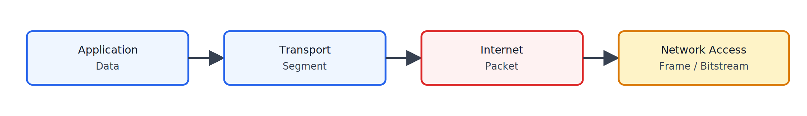
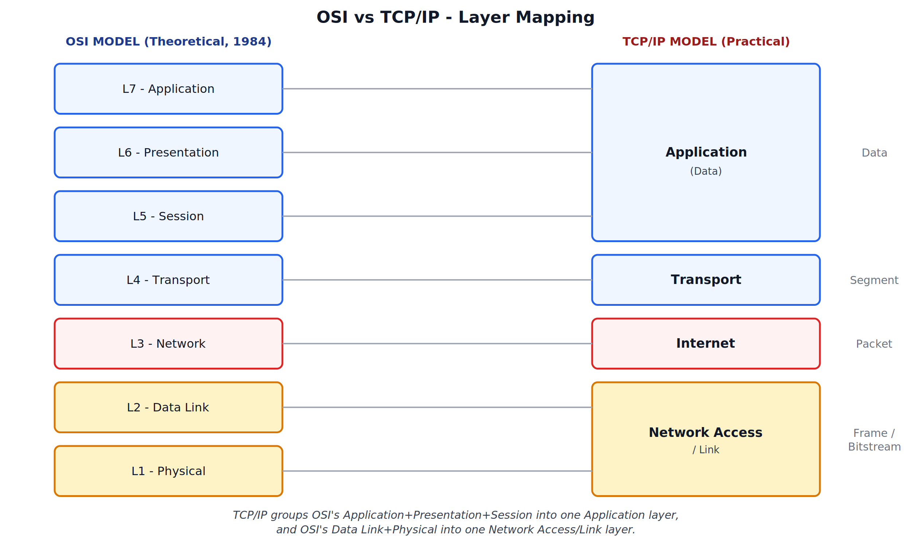

# TCP/IP Model and Comparison of TCP/IP with OSI

## 1. Introduction to TCP/IP Model

### What is TCP/IP Model

TCP/IP (Transmission Control Protocol / Internet Protocol) is the **practical, implemented** networking model that the actual Internet runs on. Unlike OSI, which was designed as a theoretical reference model first and protocols were expected to follow later, TCP/IP protocols were developed first (by the U.S. Department of Defense, ARPANET project), and the layered model was described afterward to explain how those protocols already worked.

### Key Definition (Quotable)

> "TCP/IP is a practical, four-layer networking model built around the protocols that actually operate the modern Internet, developed before a formal layered description was written for it."

### Exam Points

- TCP/IP is protocol-first, model-second. OSI is model-first, protocol-second.
- TCP/IP is the model actually used in real-world networking; OSI is used mainly as a teaching and reference framework.

---

## 2. The Four Layers of TCP/IP Model

### Overview Table

| Layer No. | Layer Name | PDU | Key Protocols |
|---|---|---|---|
| 4 | Application | Data | HTTP, HTTPS, FTP, SMTP, DNS, Telnet |
| 3 | Transport | Segment | TCP, UDP |
| 2 | Internet | Packet | IP, ICMP |
| 1 | Network Access / Link | Frame / Bitstream | Ethernet, Wi-Fi |

### Exam Points

- TCP/IP has only **4 layers**, compared to OSI's **7 layers**.
- Segments in TCP/IP terminology are also commonly called **datagrams**.

---

## 3. Layer 1: Network Access / Link Layer

### Function

Combines the responsibilities of OSI's **Data Link** and **Physical** layers into a single layer. Handles framing, MAC addressing, media access control, and the actual transmission of bits over the physical medium.

### Responsibilities

- Framing and MAC addressing — covered in detail under OSI Data Link Layer.
- Bits-to-signal conversion over copper, fiber, or wireless — covered under OSI Physical Layer.
- Ethernet and Wi-Fi are the most common real-world protocol standards implementing this layer.

---

## 4. Layer 2: Internet Layer

### Function

Equivalent to OSI's **Network Layer**. Responsible for logical (IP) addressing and routing of packets from source to destination across interconnected networks.

### Responsibilities

- IP addressing, routing, routing mask, DNS, and path determination — all covered in detail under OSI Network Layer.
- Key protocol: **IP (Internet Protocol)**. Also uses **ICMP** for error reporting and diagnostics (e.g., the "ping" command).

---

## 5. Layer 3: Transport Layer

### Function

Same role as OSI's **Transport Layer** — provides end-to-end delivery of the complete message between processes, using port addressing.

### Responsibilities

- Segmentation, flow control, error control (ARQ), port addressing — all covered in detail under OSI Transport Layer.
- Key protocols: **TCP** (connection-oriented, reliable) and **UDP** (connectionless, fast).

---

## 6. Layer 4: Application Layer

### Function

Combines the responsibilities of OSI's **Session, Presentation, and Application** layers into a single layer. Provides the interface between end-user software and the network, and internally handles whatever session management, translation, compression, or encryption the application needs.

### Responsibilities 

- Application protocols (HTTP, HTTPS, FTP, SMTP, DNS, Telnet, RDP) — covered under OSI Application Layer.
- Session handling (login/logout, authentication) and Presentation handling (translation, compression, encryption) are performed within the application itself rather than as separate protocol layers — this is exactly why modern browsers were noted to internally manage Application + Presentation + Session tasks together.

---

## 7. TCP/IP Encapsulation Flow

---

## 8. OSI vs TCP/IP - Layer Mapping Diagram (Most Important Diagram)

This diagram shows exactly how the 7 OSI layers group into the 4 TCP/IP layers.

---

## 9. Comparison of OSI and TCP/IP (Exam Important)

### Key Differences

| Parameter | OSI Model | TCP/IP Model |
|---|---|---|
| Number of Layers | 7 layers | 4 layers |
| Development Approach | Model designed first, protocols expected to fit it later | Protocols (ARPANET-era) developed first, model described afterward |
| Session and Presentation Layers | Present as separate, dedicated layers | Not present separately; their functions are handled within the Application layer |
| Nature | Theoretical / Reference model | Practical / Implemented model |
| Usage | Used mainly for teaching, understanding, and troubleshooting concepts | Used as the actual working model of the Internet |
| Network Layer Service | Supports both connection-oriented and connectionless communication | Strictly connectionless (only IP) |
| Transport Layer Service | Strictly connection-oriented | Supports both — TCP (connection-oriented) and UDP (connectionless) |
| Protocol Dependency | Protocol-independent — layers just define required services | Protocol-dependent — layers are built around specific protocols like TCP, IP |
| Reliability of Layer Distinction | Clearly distinguishes between services, interfaces, and protocols at each layer | Does not clearly distinguish between services, interfaces, and protocols |

### Similarities

- Both are **layered architectures**, dividing the communication process into independent layers.
- Both use the concept of **encapsulation** — each layer adds its own header to data received from the layer above.
- Both have comparable **Transport** and **Network/Internet** layers performing essentially the same core functions.
- Both allow for **interoperability** between devices from different vendors, as long as the same protocol suite is followed.

---

## Practice Questions

### 2-3 Marks

1. What does TCP/IP stand for?
2. List the four layers of the TCP/IP model.
3. Which OSI layers are combined into the TCP/IP Application layer?
4. Which OSI layers are combined into the TCP/IP Network Access layer?
5. State one difference between the development approach of OSI and TCP/IP.

### 5 Marks

1. Explain the four layers of the TCP/IP model with their functions and key protocols.
2. Differentiate between OSI and TCP/IP models with a comparison table.
3. Explain why the TCP/IP model has fewer layers than the OSI model.
4. Explain the difference in connection-type support between the Network/Internet layer and Transport layer across OSI and TCP/IP.

### 8-10 Marks

1. Explain the TCP/IP model in detail, describing each layer's function, PDU, and protocols, supported by a diagram.
2. Compare the OSI and TCP/IP models in detail, covering number of layers, development approach, layer mapping, and connection-type support, with a mapping diagram and comparison table.
3. Explain why TCP/IP is called a "practical model" while OSI is called a "reference model," using historical development context.

---
