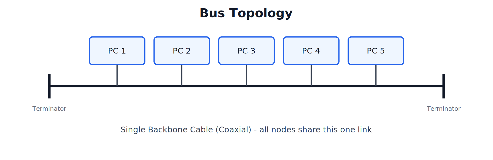
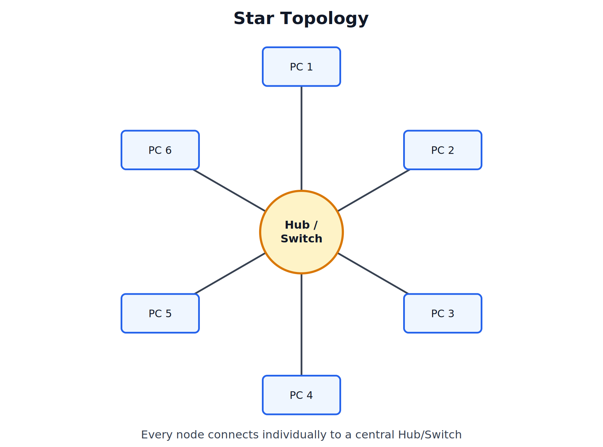
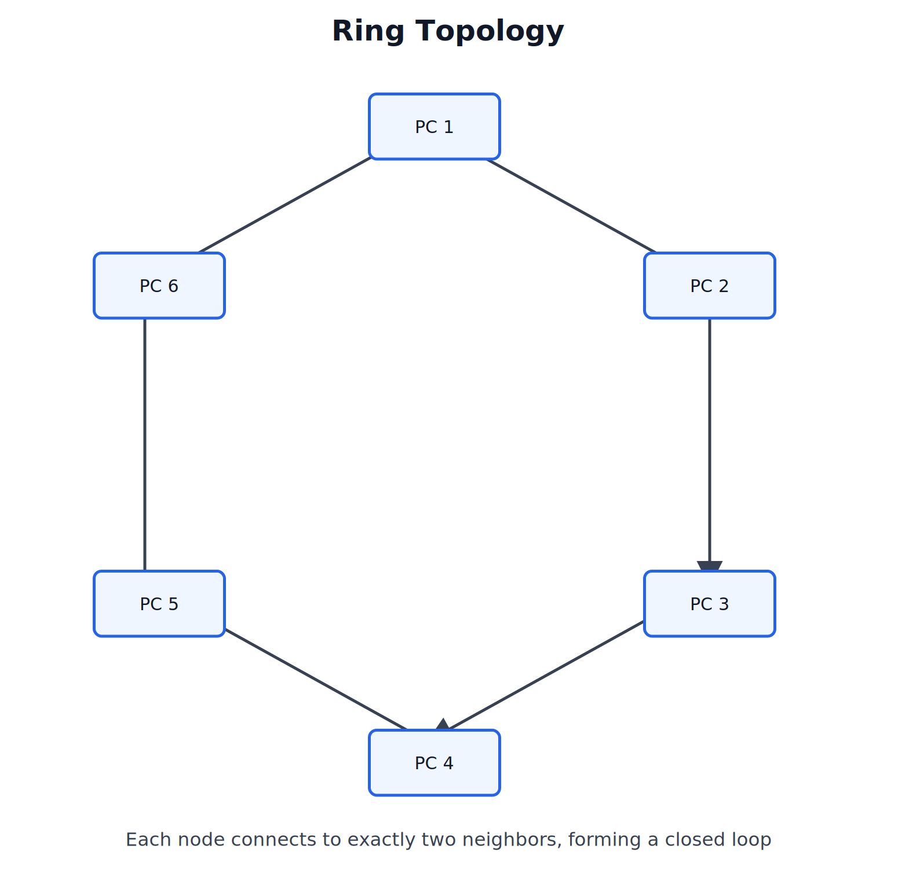
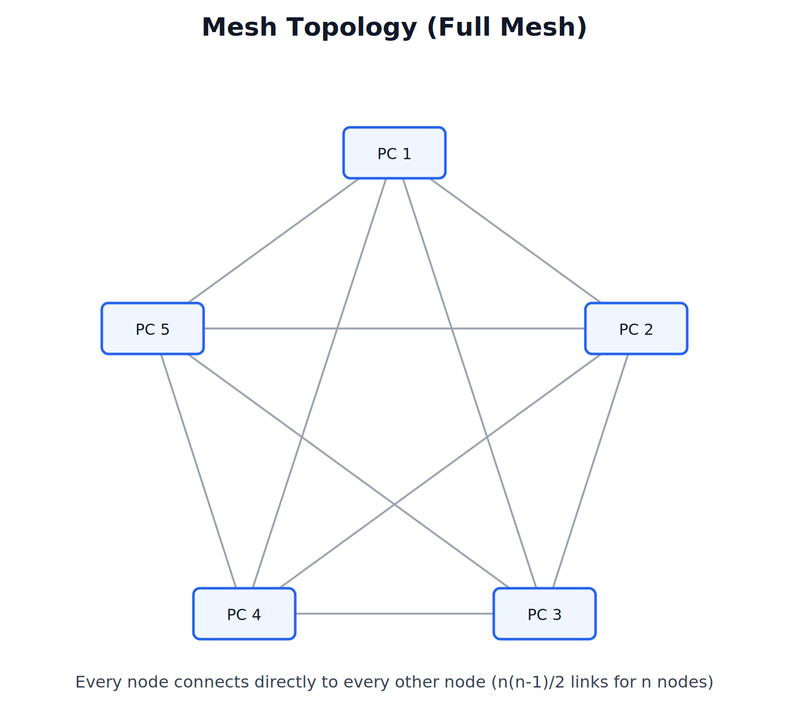
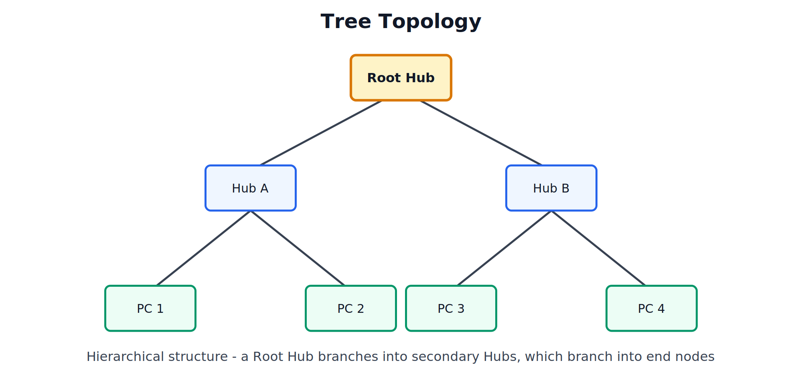
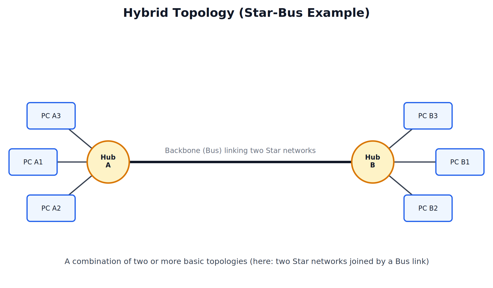

# Topology - Types, Design, and Implementation


## 1. Introduction to Topology

### What is Topology

Topology refers to the arrangement or layout pattern in which computers, cables, and other network devices are interconnected to one another, either physically or logically.

### Key Definition (Quotable)

> "Network topology is the geometric arrangement of nodes and connecting links in a network, describing how devices are physically or logically connected to each other."

### Physical Topology vs Logical Topology

| Type | Meaning |
|---|---|
| Physical Topology | The actual physical layout of cables, nodes, and devices as they are wired/arranged |
| Logical Topology | The path that data actually follows while traveling from source to destination, which may differ from the physical layout |

### Why Topology is Important

- Affects network **performance** — some layouts handle traffic more efficiently than others.
- Affects network **reliability and fault tolerance** — some layouts survive a single link/node failure better than others.
- Affects **cost** — amount of cabling and hardware required varies significantly by topology.
- Affects **scalability** — ease of adding new nodes differs across topologies.
- Affects **ease of troubleshooting and maintenance**.

---

## 2. Bus Topology

### Structure

All devices are connected to a single central cable, called the **backbone** or **bus**. Data sent by any device travels along this shared cable and is received by all other devices, though only the intended recipient processes it.



### Working

- A **terminator** is placed at each end of the backbone cable to absorb the signal and prevent it from reflecting back (signal bounce).
- Data travels in both directions along the bus until it reaches the terminator.

### Advantages

- Requires the **least amount of cable** compared to other topologies — cost-effective.
- Easy to install for a small network.
- Works well for a small number of nodes.

### Disadvantages

- If the **backbone cable fails**, the entire network goes down.
- Performance degrades significantly as more nodes are added (shared bandwidth).
- Difficult to troubleshoot — a single fault can be hard to isolate.
- Limited cable length and number of nodes it can support.

### Use Case

Small, simple networks where cost is a primary concern and high reliability is not critical (largely historical/legacy use today).

---

## 3. Star Topology

### Structure

All devices are connected individually to a central device — a **hub or switch**. There is no direct connection between peripheral nodes; all communication passes through the central device.



### Working

- Each node has its own dedicated link to the hub/switch.
- The hub/switch manages and directs all data traffic between nodes.

### Advantages

- **Easy to install and reconfigure** — adding or removing a node affects only that one connection.
- **Failure of one node/cable does not affect the rest of the network.**
- Centralized management makes troubleshooting easier.
- High performance since each link has dedicated bandwidth (with a switch).

### Disadvantages

- If the **central hub/switch fails**, the entire network goes down (single point of failure).
- Requires more cable than bus topology.
- Cost of the central device adds to overall network cost.

### Use Case

The most widely used topology today for LANs in offices, colleges, and homes.

---

## 4. Ring Topology

### Structure

Each device is connected to exactly two other devices, forming a continuous closed loop (ring). Data travels around the ring, typically in one direction (unidirectional), passing through each node until it reaches the destination.



### Working

- Each node acts as a **repeater**, receiving the signal and forwarding it to the next node in the ring.
- A **token** (in Token Ring networks) may be used to control which node is allowed to transmit at a given time, avoiding collisions.

### Advantages

- Performs better than bus topology under heavy network load, since each node only deals with its immediate neighbors.
- Data transmission is relatively orderly (no collisions when using token-based access).
- Easier to identify faults compared to bus (signal loss location can be narrowed down).

### Disadvantages

- **Failure of a single node or link can disrupt the entire network** (unless a dual/redundant ring is used).
- Adding or removing a node requires temporarily breaking the ring.
- Data must pass through multiple nodes, increasing delay for nodes far from the source.

### Use Case

Was historically used in Token Ring and FDDI (Fiber Distributed Data Interface) networks; less common today.

---

## 5. Mesh Topology

### Structure

Every device is connected directly to every other device in the network via a dedicated point-to-point link. This is called a **full mesh**. (A **partial mesh** connects only some device pairs directly, relying on other nodes to relay data for the rest.)



### Number of Links Required

For a full mesh with **n** nodes, the total number of links required is:

```
Number of links = n(n-1) / 2
```

For the 5-node example above: 5(5-1)/2 = **10 links**.

### Advantages

- **Highly reliable and fault-tolerant** — failure of one link does not affect communication between other nodes, since alternate paths exist.
- **No traffic congestion** — dedicated links mean no shared bandwidth issues.
- High level of privacy/security for point-to-point links.

### Disadvantages

- **Very high cost** — requires a large amount of cabling and a large number of I/O ports per device, especially as the network grows.
- Difficult to install and reconfigure due to the sheer number of connections.
- Not scalable — the number of links grows quadratically (n(n-1)/2) as nodes increase.

### Use Case

Critical infrastructure networks (e.g., backbone of the Internet between major routers, military and defense networks) where reliability outweighs cost.

---

## 6. Tree Topology

### Structure

A hierarchical structure that combines characteristics of star and bus topologies — a **root hub** connects to secondary hubs, which in turn connect to end devices, forming a structure similar to an organizational chart.



### Working

- The root hub is the top of the hierarchy; all data eventually flows through it when devices in different branches communicate.
- Each branch can be managed and expanded somewhat independently.

### Advantages

- **Easily scalable** — new branches (secondary hubs and their nodes) can be added without disturbing the rest of the network.
- Fault isolation is easier — a fault in one branch does not necessarily affect other branches.
- Supported by most networking hardware and software; point-to-point wiring per segment.

### Disadvantages

- **Heavily dependent on the root hub** — if it fails, the entire network (or large portions of it) can be affected.
- Requires more cabling than a simple bus.
- As the hierarchy grows deeper, performance can degrade due to the number of hops to reach the root.

### Use Case

Large organizations and campus networks where departments/floors need to be organized hierarchically (e.g., a university network with a root connecting to per-building or per-department hubs).

---

## 7. Hybrid Topology

### Structure

A combination of two or more different basic topologies, used together to leverage the advantages of each while minimizing their individual disadvantages.



### Working

In the example above, two Star networks (each with their own hub and set of nodes) are connected together using a Bus-style backbone link between the two hubs.

### Advantages

- **Flexible and scalable** — can be designed to combine the best features of the topologies used.
- Fault in one part of the network (e.g., one star cluster) can often be isolated without affecting the other parts.
- Can be tailored to the specific needs of an organization (department-wise star clusters connected via a backbone, for example).

### Disadvantages

- **Complex to design, install, and manage** compared to a single pure topology.
- Generally **more expensive** due to the combination of hardware requirements from multiple topology types.

### Use Case

Large enterprise and campus networks that need the reliability of star networks at the department level, connected together efficiently at the backbone level.

---

## 8. Consolidated Comparison Table (Most Important Exam Table)

| Topology | Cabling Cost | Fault Tolerance | Scalability | Single Point of Failure | Typical Use |
|---|---|---|---|---|---|
| Bus | Lowest | Poor (whole network fails if backbone fails) | Poor | Backbone cable | Small legacy networks |
| Star | Moderate | Good (one node failure is isolated) | Good | Central hub/switch | Most common LANs today |
| Ring | Moderate | Poor (single break disrupts ring, unless dual ring) | Moderate | Any node/link in the ring | Token Ring, FDDI (legacy) |
| Mesh | Very High | Excellent (multiple alternate paths) | Poor (cost grows quadratically) | None (highly redundant) | Backbone/critical infrastructure |
| Tree | High | Moderate (depends heavily on root hub) | Good (branches expand easily) | Root hub | Large hierarchical organizations |
| Hybrid | High | Good (isolatable by section) | Good | Depends on design | Large enterprise/campus networks |

---

## 9. Design Considerations for Choosing a Topology

- **Cost**: Budget available for cabling, hardware (hubs/switches), and installation.
- **Scalability**: How easily the network needs to grow in the future.
- **Fault Tolerance / Reliability**: How critical it is that the network survives individual node or link failures.
- **Ease of Installation and Maintenance**: Some topologies (star) are far simpler to install, troubleshoot, and maintain than others (mesh).
- **Performance Requirements**: Bandwidth needs and expected traffic load.
- **Physical Constraints**: Building layout, distance between nodes, and available cable pathways.

---

## Practice Questions

### 2-3 Marks

1. Define topology. Differentiate between physical and logical topology in one line.
2. What is the formula to calculate the number of links in a full mesh topology?
3. What is a terminator used for in bus topology?
4. Name the single point of failure in star topology and in bus topology.
5. What is the difference between a full mesh and a partial mesh?

### 5 Marks

1. Explain bus and star topology with their advantages and disadvantages.
2. Explain ring topology, including its working and use of a token.
3. Explain mesh topology and calculate the number of links required for 6 nodes in a full mesh.
4. Explain tree topology and why it is considered a combination of star and bus characteristics.
5. What design considerations should be kept in mind while choosing a network topology?

### 8-10 Marks

1. Explain all six network topologies (Bus, Star, Ring, Mesh, Tree, Hybrid) with diagrams, advantages, and disadvantages.
2. Compare all six topologies in detail with a comparison table covering cost, fault tolerance, scalability, and single point of failure.
3. Explain hybrid topology in detail with an example, and discuss why organizations choose hybrid topologies over pure topologies.
4. Discuss the design considerations involved in selecting an appropriate network topology for a large organization, referencing specific topology trade-offs.

---
