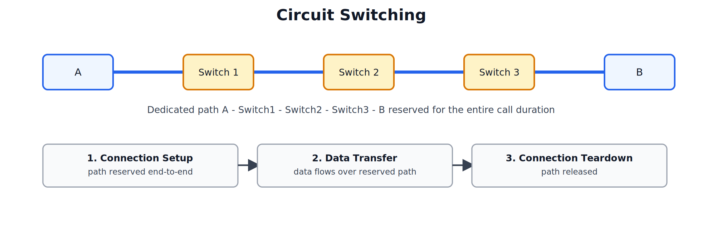
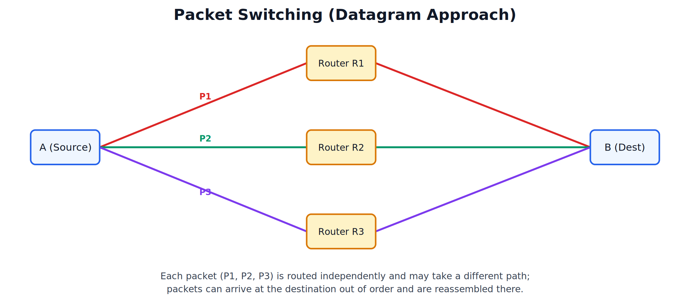
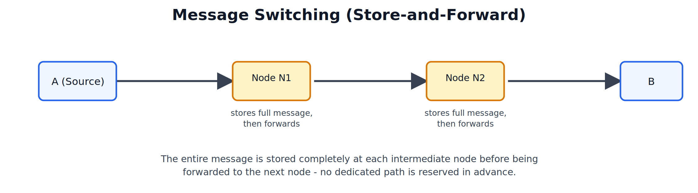
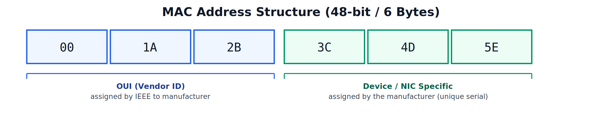

# Types of Switching Network and MAC Address

---

## 1. Introduction to Switching

### What is Switching

Switching is the technique used to move data from a source to a destination across a network that consists of multiple interconnected nodes/switches, where a direct dedicated link between every pair of devices is not practical.

### Key Definition

> "Switching is the mechanism by which data is transferred from a source device to a destination device through a network of intermediate switching nodes."

### Why Switching is Needed

- A network with a large number of devices cannot practically have a dedicated physical link between every pair of devices (recall: this is exactly why full **Mesh topology**
- Switching allows data to be forwarded through a shared set of intermediate nodes (switches/routers) instead.

### Three Types of Switching

1. Circuit Switching
2. Packet Switching
3. Message Switching

---

## 2. Circuit Switching

### Concept

In circuit switching, a **dedicated physical communication path (circuit)** is established between the source and destination **before** any data transfer begins. This path remains reserved for the entire duration of the communication session, even during periods of silence/inactivity.

### Three Phases of Circuit Switching

1. **Connection Setup**: A dedicated end-to-end path is established and reserved through all intermediate switches.
2. **Data Transfer**: Data flows continuously over the reserved path.
3. **Connection Teardown**: Once communication is complete, the path is released, freeing up resources for other connections.

### Key Definition

> "Circuit switching is a switching technique in which a dedicated communication path is established between sender and receiver before data transmission begins, and this path is held for the entire session."

### Advantages

- Guaranteed, **constant bandwidth** for the entire duration of the session — no congestion once the circuit is set up.
- Data arrives in the **same order** it was sent, with no need for reassembly.
- Suitable for **continuous, real-time** communication such as voice calls.

### Disadvantages

- **Inefficient use of bandwidth** — the reserved path remains occupied even during idle periods (e.g., silence during a phone call).
- **Connection setup takes time** before actual data transfer can begin.
- If any single switch/link along the reserved path fails, the entire connection is lost and must be re-established.
- Not scalable for bursty data traffic (like typical Internet browsing).

### Example / Use Case

The traditional **telephone network (PSTN)** is the classic real-world example of circuit switching.

---

## 3. Packet Switching

### Concept

In packet switching, data is broken into smaller units called **packets**, and each packet is transmitted independently through the network. Packets may take different paths to reach the destination and are reassembled in the correct order once they arrive (this is the **datagram approach**, as opposed to a virtual-circuit approach where all packets of a session follow the same pre-established logical path).

### Key Definition

> "Packet switching is a switching technique in which data is divided into packets, and each packet is transmitted independently through the network, potentially via different paths, and reassembled at the destination."

### Advantages

- **Efficient use of bandwidth** — no path is reserved exclusively; the network link is shared dynamically among multiple communications.
- **No connection setup delay** — packets can be sent immediately.
- **Fault tolerant** — if one path/link fails, packets can be rerouted via an alternate path.
- Well suited for **bursty data traffic** (typical of Internet/web traffic).

### Disadvantages

- Packets may **arrive out of order**, requiring reassembly logic at the destination.
- **Variable delay (jitter)** — since different packets may take different paths, delivery time is not constant, making it less ideal for strict real-time applications compared to circuit switching.
- Requires additional processing at each node (routing decisions, addressing) — recall the Network Layer's job of **routing** and **packet formation** (Segment + Source IP + Destination IP).

### Example / Use Case

The **Internet** is the primary real-world example of a packet-switched network.

---

## 4. Message Switching

### Concept

In message switching, the entire message is sent as a single unit from the source to an intermediate node, where it is **completely stored**, and then **forwarded** to the next node once the outgoing link is available. This is known as **store-and-forward** switching. No dedicated path is established in advance.

### Key Definition 

> "Message switching is a switching technique in which the entire message is stored completely at each intermediate node before being forwarded to the next node, without any dedicated path being reserved in advance."

### Advantages

- **No dedicated path required** — efficient use of available links, since a path is only used when actually needed for forwarding.
- Can handle **network congestion** more gracefully — messages can be queued at intermediate nodes when the next link is busy.
- Supports **broadcasting** a message to multiple destinations at once.

### Disadvantages

- **High storage requirement** at each intermediate node — the entire message must be stored at once, which can be a large amount of data.
- **High latency/delay** — since the full message must be received and stored before it can even begin being forwarded, this is typically slower than packet switching.
- Not suitable for **real-time or interactive** communication.

### Example / Use Case

Historically used in **telegraph networks** and early **email/store-and-forward messaging systems**.

---

## 5. Comparison of Switching Techniques (Most Important Exam Table)

| Parameter | Circuit Switching | Message Switching | Packet Switching |
|---|---|---|---|
| Path Reservation | Dedicated path reserved in advance | No dedicated path; store-and-forward at each node | No dedicated path; each packet routed independently |
| Data Unit | Continuous stream (no division) | Entire message as one unit | Message divided into packets |
| Delay | Setup delay, then constant low delay | High delay (full message stored at each hop) | Variable delay (jitter possible) |
| Bandwidth Utilization | Poor (reserved even when idle) | Better than circuit switching | Best — dynamically shared |
| Order of Delivery | Always in order | In order (single unit) | May arrive out of order; reassembled at destination |
| Fault Tolerance | Poor — entire path fails together | Moderate | Good — alternate paths possible |
| Real-Time Suitability | Excellent (e.g., voice calls) | Poor | Moderate to good (with proper protocols) |
| Real-World Example | Telephone network (PSTN) | Telegraph networks, early email systems | The Internet |

---

## 6. MAC Address

### What is MAC Address

MAC (Media Access Control) address is a unique, physical hardware address assigned to the Network Interface Card (NIC) of every network-capable device, used for addressing at the **Data Link Layer**

### Key Definition 

> "A MAC address is a unique 48-bit hardware address assigned to a network interface card, used to identify a device at the Data Link Layer of a network."

### Structure of a MAC Address

A MAC address is **48 bits (6 bytes)** long, typically written as 6 pairs of hexadecimal digits separated by colons or hyphens (e.g., `00:1A:2B:3C:4D:5E`).

- **First 3 bytes (24 bits) — OUI (Organizationally Unique Identifier)**: Assigned by the IEEE to the device manufacturer (identifies the vendor, e.g., Intel, Dell, Cisco).
- **Last 3 bytes (24 bits) — Device/NIC Specific**: Assigned by the manufacturer itself, forming a unique serial number for that specific network card.

### Key Properties of MAC Address

- **Globally unique** — no two network devices should have the same MAC address.
- **Burned into hardware** — permanently assigned to the NIC at the time of manufacture (also called a **physical address** or **burned-in address**).
- **Does not change** even if the device moves to a different network (unlike an IP address, which can change based on the network it connects to).

### Purpose of MAC Address

- Used for **node-to-node (hop-to-hop) delivery** within a single network segment/LAN.
- Enables **framing** at the Data Link Layer — every frame carries a source and destination MAC address.
- Used by protocols like **ARP (Address Resolution Protocol)** to map an IP address to its corresponding MAC address on a local network.

---

## 7. MAC Address vs IP Address

| Parameter | MAC Address | IP Address |
|---|---|---|
| Layer | Data Link Layer (Layer 2) | Network Layer (Layer 3) |
| Length | 48 bits (6 bytes) | 32 bits for IPv4 (4 bytes) |
| Assigned By | Manufacturer (burned into hardware) | Network administrator / DHCP server (can change) |
| Nature | Physical / Permanent address | Logical / Changeable address |
| Scope of Use | Identifies a device within a local network (LAN) | Identifies a device across interconnected networks (routable, global) |
| Changes When Device Moves? | No — stays the same | Yes — typically changes based on the network it joins |
| Example Format | 00:1A:2B:3C:4D:5E | 192.168.1.209 |

### Exam Points

- MAC address handles **local delivery** (within the same network); IP address handles **global/routed delivery** (across networks) — this distinction connects directly to the OSI Host-to-Host diagram , where MAC addressing is used hop-to-hop, while IP addressing is used end-to-end.
- A common exam trap: a device's MAC address never changes across networks, but its IP address usually does — remember this contrast clearly for viva questions.

---

## Practice Questions

### 2-3 Marks

1. Define switching. List the three types of switching.
2. What are the three phases of circuit switching?
3. Define MAC address and state its length.
4. What does OUI stand for, and what does it identify?
5. Give one real-world example each of circuit switching and packet switching.

### 5 Marks

1. Explain circuit switching with its advantages and disadvantages.
2. Explain packet switching and why it is well suited for bursty Internet traffic.
3. Explain message switching and the concept of store-and-forward.
4. Explain the structure of a MAC address with its two main components.
5. Differentiate between MAC address and IP address.

### 8-10 Marks

1. Explain all three switching techniques (circuit, message, packet) in detail with diagrams, and compare them using a comparison table.
2. Explain circuit switching and packet switching in detail, highlighting why the Internet uses packet switching rather than circuit switching.
3. Explain the structure and purpose of a MAC address, and differentiate it from an IP address with a comparison table.
4. Discuss the advantages and disadvantages of each switching technique and identify which technique is best suited for (a) a phone call, (b) web browsing, (c) a broadcast telegram-style message.

---
