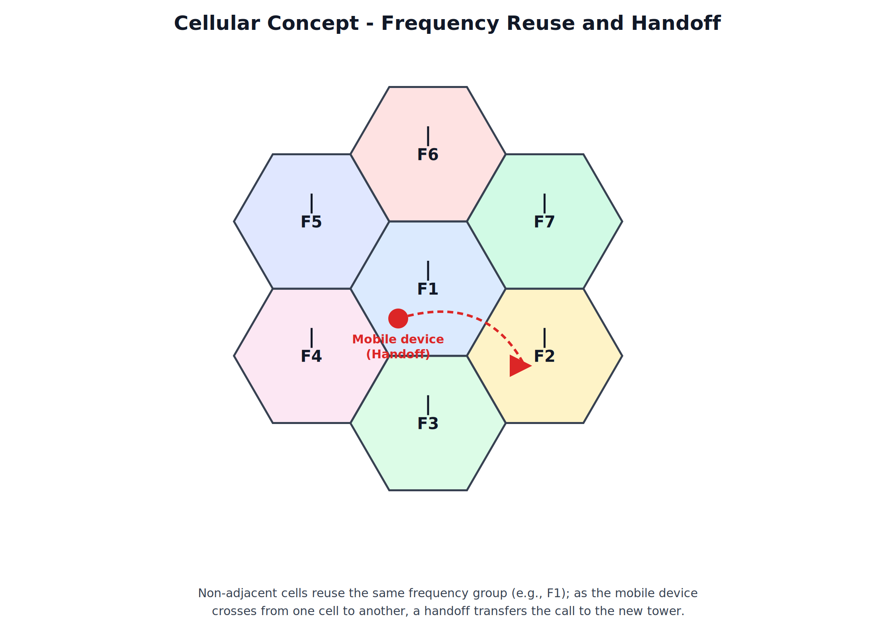
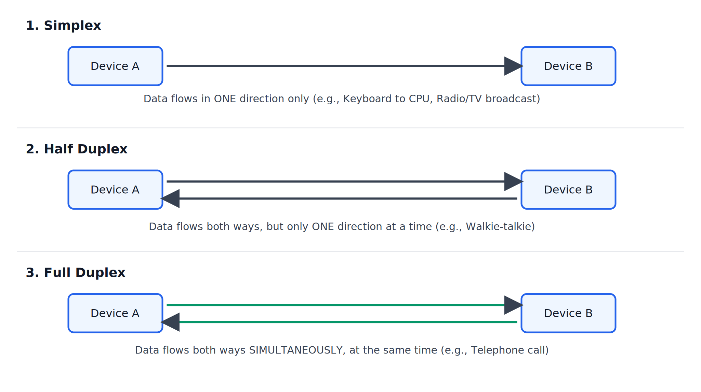
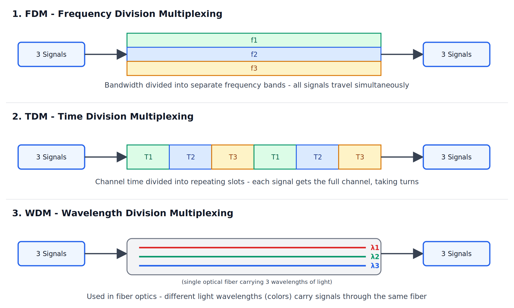

# Mobile Telephone System, Transmission Modes, and Multiplexing

---

## 1. Mobile Telephone System

### The Cellular Concept

Mobile communication is built on the idea of dividing a large geographical area into smaller regions called **cells**, each served by its own **base station (tower)**. Cells are typically represented as hexagons because a hexagonal layout provides efficient, gap-free, non-overlapping coverage of an area.

### Key Definition (Quotable)

> "The cellular concept divides a coverage area into smaller cells, each served by its own base station, allowing efficient reuse of limited frequency resources across a large geographical area."

### Frequency Reuse

Since the number of available frequency channels is limited, mobile networks reuse the same frequencies in **non-adjacent** cells (cells far enough apart that they don't interfere with each other). Adjacent cells are always assigned **different** frequency groups to avoid interference.

In the diagram above, the center cell uses frequency group F1. None of its six immediate neighbors use F1 — they use F2 through F7 instead. A cell further away could reuse F1 again, since it is far enough from the center cell to avoid interference.

### Handoff / Handover

**Handoff** (also called **handover**) is the process by which an ongoing call or data session is automatically transferred from one cell's base station to another as the mobile device moves out of range of the current cell and into a neighboring one — without the user noticing any interruption.

### Exam Points

- Frequency reuse is what makes cellular networks scalable — without it, the limited frequency spectrum could never support millions of simultaneous mobile users.
- Handoff must happen quickly and seamlessly; a poorly managed handoff causes a **dropped call**.

### Generations of Mobile Telephone Systems (1G to 5G)

| Generation | Approx. Era | Technology Type | Key Feature |
|---|---|---|---|
| 1G | 1980s | Analog | Voice calls only, analog signal, poor security |
| 2G | 1990s | Digital (GSM/CDMA) | Digital voice, SMS text messaging introduced |
| 3G | 2000s | Digital + Packet Switching | Mobile internet, video calling, higher data speeds |
| 4G | 2010s | LTE (Long Term Evolution) | High-speed mobile broadband, HD video streaming, VoLTE |
| 5G | 2020s onward | New Radio (NR) | Very high speed, ultra-low latency, supports IoT and massive device density |

### Exam Points

- Each generation roughly represents a leap in data speed and the shift from purely voice-oriented systems (1G, 2G) toward data/internet-oriented systems (3G onward).
- 5G is notable for enabling extremely low latency, which is critical for applications like autonomous vehicles and industrial IoT, not just faster browsing.

---

## 2. Transmission Modes

Transmission mode defines the **direction** in which data can flow between two connected devices over a communication link.

### 2.1 Simplex

- Data flows in **only one direction**, never the reverse.
- The sending device can only send, and the receiving device can only receive.
- **Example**: Keyboard to CPU, radio broadcast, television broadcast.

### 2.2 Half Duplex

- Data can flow in **both directions**, but **not at the same time** — only one direction is active at any given moment.
- Devices must take turns transmitting.
- **Example**: Walkie-talkie communication (press-to-talk).

### 2.3 Full Duplex

- Data flows in **both directions simultaneously** — both devices can send and receive at the same time.
- Provides the most efficient use of the communication link in terms of throughput.
- **Example**: A telephone call (both parties can speak and listen at the same time).

### Key Definition (Quotable)

> "Transmission mode defines the direction of data flow between two devices: Simplex allows one-way flow only, Half Duplex allows two-way flow but not simultaneously, and Full Duplex allows two-way flow at the same time."

### Comparison Table

| Parameter | Simplex | Half Duplex | Full Duplex |
|---|---|---|---|
| Direction of Flow | One direction only | Both directions, one at a time | Both directions simultaneously |
| Efficiency / Throughput | Lowest (one-way only) | Moderate | Highest |
| Example | Keyboard to CPU, Radio broadcast | Walkie-talkie | Telephone call |

---

## 3. Multiplexing

### What is Multiplexing

Multiplexing is a technique that allows **multiple signals to be combined and transmitted simultaneously over a single shared communication channel**, making efficient use of the available bandwidth. At the receiving end, a **demultiplexer** separates the combined signal back into its original individual signals.

### Key Definition (Quotable)

> "Multiplexing is the process of combining multiple signals into one signal over a shared medium, allowing efficient utilization of the channel's bandwidth."

### 3.1 FDM - Frequency Division Multiplexing

- The available bandwidth of the channel is divided into multiple smaller, non-overlapping **frequency bands**.
- Each signal is assigned its own frequency band and is transmitted **continuously and simultaneously** with the others.
- Used in traditional radio and television broadcasting, and older analog telephone systems.

### 3.2 TDM - Time Division Multiplexing

- The channel's total transmission **time** is divided into small, repeating **time slots**.
- Each signal is assigned a specific time slot and gets the **full bandwidth** of the channel during its turn.
- Signals take turns cycling through their assigned slots repeatedly.
- Widely used in digital telephone networks.

### 3.3 WDM - Wavelength Division Multiplexing

- Conceptually similar to FDM, but specifically used in **fiber optic communication**.
- Multiple signals are carried simultaneously using **different wavelengths (colors) of light** through the same optical fiber strand.
- Enables very high data-carrying capacity on a single fiber, since many independent wavelength channels can run in parallel.

### Comparison Table

| Parameter | FDM | TDM | WDM |
|---|---|---|---|
| Basis of Division | Frequency | Time | Wavelength (light) |
| Medium | Typically used on copper/radio | Digital telephone/data links | Fiber optic cable |
| Simultaneous Transmission | Yes, on separate frequencies | No — signals take turns in time slots | Yes, on separate wavelengths |
| Common Use | Radio, TV broadcasting | Digital telephone networks | High-capacity fiber optic backbones |

### Exam Points

- FDM and WDM are conceptually the same idea (splitting the channel into simultaneous parallel sub-channels) — FDM does this using electrical frequency, WDM does this using light wavelength.
- TDM is fundamentally different — it does not split the channel into parallel sub-channels at all; instead, it gives each signal the *entire* channel, but only for a short time slot, cycling rapidly between signals.

---

## Practice Questions

### 2-3 Marks

1. Define handoff/handover.
2. Why are cells typically represented as hexagons?
3. Define multiplexing.
4. Give one example each of simplex, half duplex, and full duplex communication.
5. What is the key difference between FDM and TDM?

### 5 Marks

1. Explain the cellular concept and frequency reuse with a diagram.
2. Explain the three transmission modes with examples and a comparison table.
3. Explain FDM and TDM with their working and use cases.
4. Briefly describe the evolution of mobile telephone systems from 1G to 5G.
5. Explain WDM and why it is specifically used in fiber optic communication.

### 8-10 Marks

1. Explain the cellular concept, frequency reuse, and handoff in detail with a suitable diagram.
2. Explain all three transmission modes in detail with diagrams, examples, and a comparison table.
3. Explain FDM, TDM, and WDM in detail with diagrams, and compare them using a comparison table.
4. Discuss the generational evolution of mobile telephone systems (1G-5G), highlighting the key technological shift at each stage.

---
