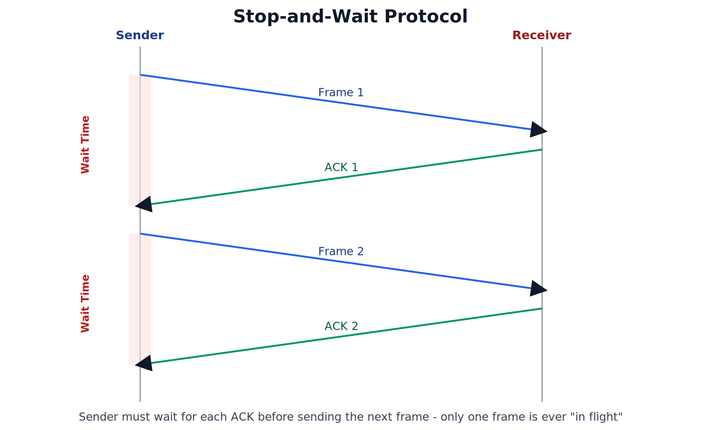
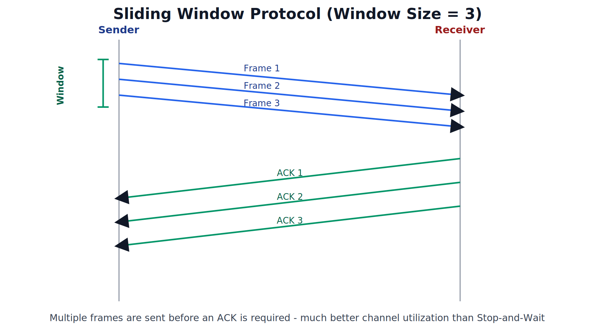

# Stop-and-Wait Protocol, Sliding Window Protocol

---

## 1. Introduction to Flow Control Protocols

### Recap: What is Flow Control

Flow control ensures that a fast sender does not overwhelm a slow receiver by sending data faster than the receiver can process it. Stop-and-Wait and Sliding Window are the two classic **protocols** that implement flow control at the Data Link/Transport level, defining exactly *when* and *how many* frames a sender is allowed to transmit before requiring acknowledgment from the receiver.

---

## 2. Stop-and-Wait Protocol

### Working

In the Stop-and-Wait protocol, the sender transmits **one frame** at a time and then **stops and waits** for an acknowledgment (ACK) from the receiver before sending the next frame. Only after the ACK for the current frame is received does the sender proceed to transmit the next one.

### Key Definition (Quotable)

> "Stop-and-Wait is a flow control protocol in which the sender transmits one frame and then waits for an acknowledgment from the receiver before sending the next frame."

### Steps

1. Sender transmits Frame 1 and starts a timer.
2. Sender stops and waits (cannot send anything else).
3. Receiver receives Frame 1 and sends back ACK 1.
4. Sender receives ACK 1 and only now proceeds to send Frame 2.
5. The cycle repeats for every subsequent frame.

### Limitations

- **Very poor channel/bandwidth utilization** — the sender is idle for a significant portion of time, especially when the **propagation delay** (time for a signal to travel across the link) is large compared to the transmission time of the frame.
- Only **one frame can ever be "in flight"** at a time — this severely limits throughput on high-speed or long-distance links (e.g., satellite links).
- If an ACK is lost or delayed, the sender may need to time out and retransmit, adding further delay.

### Exam Points

- Stop-and-Wait is simple to implement but **inefficient**, particularly on links with high bandwidth-delay product (fast links or long distances, such as satellite communication).
- This inefficiency is exactly the motivation for the Sliding Window protocol described next.

---

## 3. Sliding Window Protocol

### Working

In the Sliding Window protocol, the sender is allowed to transmit **multiple frames** (up to a fixed number called the **window size**) **before** needing to wait for an acknowledgment. As acknowledgments arrive, the "window" of frames the sender is permitted to send **slides forward**, allowing new frames to be sent.

### Key Definition (Quotable)

> "Sliding Window is a flow control protocol in which the sender can transmit multiple frames, up to a fixed window size, before requiring an acknowledgment, allowing better utilization of the communication channel."

### Steps (as shown in the diagram, Window Size = 3)

1. Sender transmits Frame 1, Frame 2, and Frame 3 back-to-back, without waiting for any ACK in between (since the window size is 3).
2. Receiver receives each frame and sends back the corresponding ACK.
3. As each ACK arrives at the sender, the window "slides" forward by one, allowing the sender to transmit a new frame (e.g., Frame 4) once ACK 1 is received.
4. This process continues, keeping multiple frames continuously in transit.

### Advantage Over Stop-and-Wait

- **Much better channel utilization** — since multiple frames can be in transit simultaneously, the sender does not sit idle waiting for each individual ACK.
- Significantly higher **throughput**, especially beneficial on links with high bandwidth-delay product.

### Brief Note: Types of Sliding Window Protocols

| Variant | Behavior on Frame Loss |
|---|---|
| Go-Back-N | If one frame is lost/corrupted, the sender must retransmit that frame **and all frames after it** in the window |
| Selective Repeat | Only the **specific lost/corrupted frame** needs to be retransmitted, not the whole window |

### Exam Points

- Window size directly determines how many frames can be "in flight" at once — a window size of 1 makes Sliding Window behave exactly like Stop-and-Wait.
- Sliding Window is the flow control mechanism actually used by **TCP** in real-world networks.

---

## 4. Comparison: Stop-and-Wait vs Sliding Window

| Parameter | Stop-and-Wait | Sliding Window |
|---|---|---|
| Frames in Flight at Once | Only 1 | Multiple (up to window size) |
| Channel Utilization | Poor, especially on long/fast links | Much better |
| Complexity | Simple to implement | More complex (requires tracking multiple unacknowledged frames) |
| Throughput | Low | High |
| Real-World Use | Simple, low-speed links | Used in modern protocols like TCP |

---
