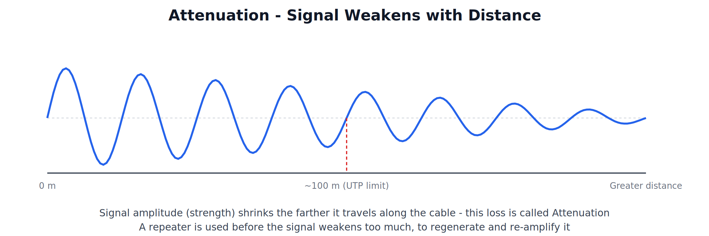

# Guided (Wired) Transmission Media

---

## 1. Introduction to Transmission Media

### What is Transmission Media

Transmission media is the physical path through which data travels from a sender to a receiver in a network. It is the actual "highway" over which signals (electrical, light, or radio) move.

"Transmission media refers to the physical pathway that carries data signals from one network device to another."

### Two Broad Categories

| Category | Meaning | Examples |
|---|---|---|
| Guided (Wired) Media | Signals travel through a physical, solid medium (a cable) | Twisted Pair, Coaxial, Fiber Optic |
| Unguided (Wireless) Media | Signals travel through free space, without a physical conductor | Radio Waves, Infrared, Microwave, Laser |

This covers all three **Guided Media** types in detail.

---

## 2. Twisted Pair Cable

### Structure

Twisted Pair cable consists of pairs of insulated copper wires **twisted around each other**. A standard Ethernet cable contains **4 such pairs (8 wires total)**.

### Why Wires are Twisted

Twisting the two wires of a pair around each other cancels out **electromagnetic interference (crosstalk)** — interference that one wire's signal would otherwise induce in a neighboring wire. The tighter the twist, the better the interference cancellation.

"Twisted pair cable is a type of guided transmission media consisting of pairs of insulated copper wires twisted together to reduce electromagnetic interference between adjacent pairs."

### UTP vs STP

| Type | Full Form | Structure |
|---|---|---|
| UTP | Unshielded Twisted Pair | No additional shielding around the pairs; relies only on the twisting for interference cancellation |
| STP | Shielded Twisted Pair | Has an additional foil or braided metal shield around the pairs for extra protection against external interference |

### Connector

**RJ-45** — an 8-pin/8-position (8P8C) connector, the standard connector used for Ethernet twisted pair cabling.

### Advantages

- Cheapest guided media option.
- Easy to install and terminate (with RJ-45 connectors).
- Flexible and lightweight cabling.

### Disadvantages

- More susceptible to electromagnetic interference and attenuation than coaxial or fiber, especially UTP.
- Limited maximum cable length before signal degrades (100 meters for standard Ethernet).
- Lower bandwidth compared to fiber optic cable.

### Use Case

The most common medium for LAN cabling in offices, homes, and colleges today.

---

## 3. Coaxial Cable

### Structure

Coaxial cable ("coax") has four concentric layers, all sharing the same central axis (hence "co-axial"):

1. **Copper Core** — the innermost conductor that carries the electrical signal.
2. **Insulating Layer (Dielectric)** — separates the core from the shield.
3. **Braided Metal Shield** — blocks external electromagnetic interference from reaching the core.
4. **Outer Plastic Jacket** — protective outer covering.

"Coaxial cable is a guided transmission medium consisting of a central copper conductor surrounded by an insulating layer, a metallic shield, and an outer protective jacket, all sharing a common axis."

### Connector

**BNC Connector** — a twist-lock (bayonet-style) connector historically used with coaxial cable.

### Advantages

- Better shielding against interference than twisted pair — the braided shield protects the core signal.
- Can carry signals over longer distances than twisted pair before requiring a repeater.
- Higher bandwidth than twisted pair.

### Disadvantages

- More expensive and less flexible (bulkier, harder to install) than twisted pair.
- Still lower bandwidth and distance capability compared to fiber optic cable.
- Largely obsolete for new LAN installations today.

### Use Case

Historically used in early Ethernet networks (Thinnet/Thicknet) and is still commonly used in **cable television (Cable TV)** distribution networks.

---

## 4. Fiber Optic Cable

### Structure

Fiber optic cable transmits data as **pulses of light** rather than electrical signals, through a thin strand of glass or plastic.

1. **Core** — the thin glass/plastic strand through which light actually travels.
2. **Cladding** — surrounds the core; has a different refractive index so that light is reflected back into the core (total internal reflection) rather than escaping.
3. **Buffer Coating** — protects the fiber from moisture and physical damage.
4. **Outer Jacket** — the outermost protective layer.

"Fiber optic cable is a guided transmission medium that carries data as pulses of light through a thin glass or plastic core, using total internal reflection to keep the light confined within the core."

### Multimode vs Single-mode Fiber

| Type | Core Size | Light Path | Best For |
|---|---|---|---|
| Multimode Fiber | Larger core | Light bounces at multiple angles inside the core | Shorter distances (e.g., within a building/campus) |
| Single-mode Fiber | Very thin core | Light travels in a single, nearly straight path | Long distances, high bandwidth (e.g., long-haul backbone links) |

### Connectors

| Connector | Style |
|---|---|
| SC | Push-pull, square body |
| ST | Twist bayonet lock, round body |
| LC | Small form factor, square body (commonly used in modern high-density installations) |

### Advantages

- **Immune to electromagnetic interference** — since it carries light, not electrical signals.
- **Very high bandwidth** — far greater data-carrying capacity than copper-based media.
- **Very long transmission distances** without significant signal loss, especially single-mode fiber.
- More secure — very difficult to "tap" a fiber line without detection.

### Disadvantages

- **Most expensive** guided media, both in cable cost and in installation/termination cost (requires specialized tools and skill).
- Physically more fragile than copper cabling — can be damaged by excessive bending.
- Requires optical-to-electrical conversion equipment at each end.

### Use Case

Backbone links between buildings, ISPs' long-distance and undersea cables, and any high-bandwidth/long-distance requirement.

---

## 5. Ethernet Cabling Standards

Ethernet LAN standards are named using the pattern **[Speed][Signal Type][Medium]** — for example, in **10Base-T**, "10" is the speed in Mbps, "Base" means baseband transmission, and "T" stands for Twisted pair. Each cable type has its own standard(s) and its own maximum segment distance before the signal needs to be regenerated.

| Standard | Cable Type | Speed | Max Segment Distance |
|---|---|---|---|
| 10Base-T | UTP | 10 Mbps | 100 m |
| 100Base-T (Fast Ethernet) | UTP | 100 Mbps | 100 m |
| 10Base2 (Thinnet) | Thin Coaxial | 10 Mbps | ~185 m |
| 10Base5 (Thicknet) | Thick Coaxial | 10 Mbps | ~500 m |
| 100Base-FX | Fiber Optic | 100 Mbps | ~2000 m (2 km) |

### Reading the Naming Convention

- **10 / 100** — the data rate in Mbps.
- **Base** — the cable uses Baseband transmission (explained below).
- **T / 2 / 5 / FX** — identifies the medium: T = Twisted pair, 2 = thin coax ("2" loosely refers to its ~200 m class range), 5 = thick coax (historically rated up to 500 m), FX = Fiber, Fast Ethernet.

### Why Distance Limits Differ

The maximum segment distance is different for each medium because each medium attenuates (weakens) the signal at a different rate — UTP attenuates fastest, thick coax slower, and fiber optic attenuates by far the least, which is why it supports the longest distance before the signal needs to be regenerated.

---

## 6. Baseband vs Broadband Transmission

### Baseband Transmission

In baseband transmission, the entire bandwidth of the cable is used to carry a **single digital signal** at a time — the whole channel is dedicated to one data stream. Standard Ethernet cabling (10Base-T, 10Base2, 10Base5) uses baseband transmission.

### Broadband Transmission

In broadband transmission, the cable's total bandwidth is divided into multiple separate frequency channels, allowing **multiple signals to travel simultaneously** over the same cable — each in its own channel. Cable television (Cable TV) distribution is the classic example of broadband transmission over coaxial cable.

| Parameter | Baseband | Broadband |
|---|---|---|
| Channels on the cable | One (digital signal) | Multiple (frequency-divided) |
| Typical Use | Standard Ethernet LANs | Cable TV distribution |
| Signal Type | Digital | Analog (or a mix) |

---

## 7. Attenuation

### What is Attenuation

Attenuation is the gradual loss of signal strength as it travels along a transmission medium. Every guided medium attenuates a signal to some degree — the longer the cable, the weaker the signal becomes by the time it reaches the other end.

### Why This Matters

- Each cabling standard's maximum segment distance (see the table above) exists specifically because of attenuation — beyond that distance, the signal becomes too weak to be reliably read by the receiver.
- A **repeater** is used to regenerate and re-amplify a weakening signal before it degrades too far, allowing a network to span distances greater than a single segment's limit.
- Attenuation is one of the key reasons fiber optic cable can run so much farther than copper — light signals attenuate far more slowly over distance than electrical signals do.

---

## 8. Comparison of Guided Media

| Parameter | Twisted Pair | Coaxial Cable | Fiber Optic |
|---|---|---|---|
| Signal Carried | Electrical | Electrical | Light |
| Bandwidth | Low to Moderate | Moderate | Very High |
| Interference Immunity | Low (UTP) / Moderate (STP) | Moderate to Good | Excellent (immune to EMI) |
| Cost | Lowest | Moderate | Highest |
| Installation Ease | Easiest | Moderate | Difficult (specialized tools needed) |
| Max Distance (without repeater) | Shortest (100 m) | Moderate (185-500 m) | Longest (~2 km) |
| Common Connector | RJ-45 | BNC | SC / ST / LC |
| Typical Use Today | LAN cabling (offices, homes) | Cable TV, legacy Ethernet | Backbone links, ISPs, long-distance |
