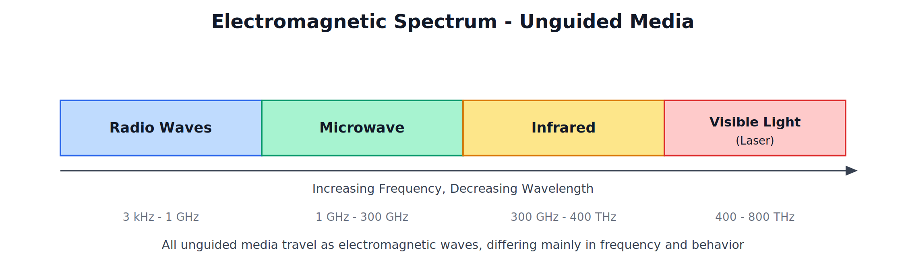
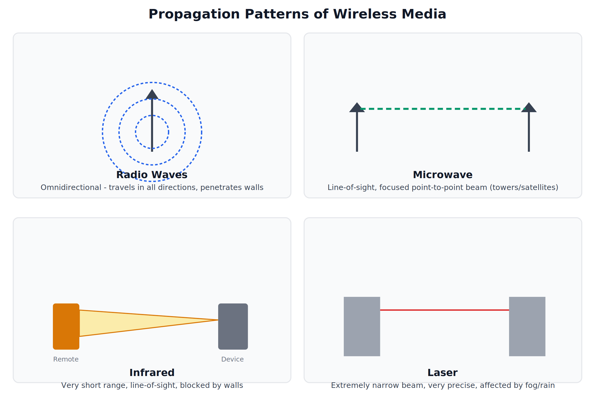

# Unguided (Wireless) Transmission Media 

---

## 1. Introduction to Unguided Media

Unguided media carry signals through free space rather than through a physical conductor. The signal is broadcast through air (or space) as electromagnetic waves, and any receiver within range and properly tuned can pick it up.

"Unguided transmission media refers to wireless communication where electromagnetic signals travel through free space rather than a physical conducting path."

All unguided media are part of the electromagnetic spectrum, differing mainly in their frequency range, which determines how they behave — how far they travel, whether they can pass through obstacles, and how directional they are.

---

## 2. Radio Waves

### Structure and Behavior

Radio waves are electromagnetic waves in the lower frequency range of the spectrum (roughly 3 kHz to 1 GHz). They are **omnidirectional** — transmitted in all directions from the source antenna, so the transmitter and receiver do not need to be precisely aligned.

"Radio waves are omnidirectional electromagnetic waves capable of traveling long distances and penetrating obstacles such as walls and buildings."

### Characteristics

- Can travel long distances and penetrate solid obstacles like walls and buildings, unlike higher-frequency unguided media.
- Easy to generate and does not require line-of-sight alignment between sender and receiver.
- Susceptible to interference from other devices operating in the same frequency band.

### Applications

AM/FM radio broadcasting, television broadcasting, cordless phones, Wi-Fi, Bluetooth, and walkie-talkies.

---

## 3. Microwave

### Structure and Behavior

Microwaves occupy a higher frequency range than radio waves (roughly 1 GHz to 300 GHz). Unlike radio waves, microwaves are **directional** and require a clear **line-of-sight** path between the transmitting and receiving antennas (usually parabolic dish antennas mounted on towers).

"Microwave transmission is a line-of-sight, directional form of wireless communication, typically used for point-to-point links between two fixed locations."

### Two Types of Microwave Systems

| Type | Description |
|---|---|
| Terrestrial Microwave | Uses dish antennas on towers on Earth's surface; towers must be spaced with a clear line of sight, often on hilltops or tall buildings |
| Satellite Microwave | Uses a satellite in space as a relay station between two or more ground stations, allowing communication over much larger distances |

### Characteristics

- Higher bandwidth than radio waves, allowing more data to be carried.
- Requires unobstructed line-of-sight — buildings, hills, or heavy rain can degrade or block the signal.
- Antennas must be precisely aligned toward each other.

### Applications

Long-distance telephone communication, television signal relay, satellite communication (GPS, satellite TV), and point-to-point wireless links between buildings.

---

## 4. Infrared

### Structure and Behavior

Infrared uses a still higher frequency range (roughly 300 GHz to 400 THz), just below visible light. It requires **line-of-sight** and cannot penetrate solid objects such as walls — a closed door is enough to block an infrared signal.

"Infrared transmission uses electromagnetic waves just below the visible light spectrum for short-range, line-of-sight communication that cannot pass through solid obstacles."

### Characteristics

- Very short range compared to radio and microwave.
- Cannot pass through walls or other solid obstacles — this is actually useful, since it prevents interference between infrared devices in adjacent rooms.
- Relatively inexpensive to implement.
- Not regulated by government licensing (unlike some radio frequency bands), since its short range limits interference potential.

### Applications

TV and air-conditioner remote controls, short-range device-to-device communication (older mobile phones' IrDA data transfer), and some short-range indoor wireless links.

---

## 5. Laser

### Structure and Behavior

Laser (Light Amplification by Stimulated Emission of Radiation) transmission uses a highly focused, coherent, single-wavelength beam of light. It requires **very precise line-of-sight alignment** between transmitter and receiver, since the beam is extremely narrow.

"Laser transmission is a highly directional form of wireless communication using a narrow, coherent beam of light for point-to-point links, typically over rooftops or between buildings."

### Characteristics

- Extremely narrow, highly focused beam — capable of carrying very high bandwidth.
- Requires exact alignment between the two endpoints; even small physical movement (e.g., building sway) can disrupt the link.
- Performance is significantly affected by weather conditions such as fog, rain, or heavy dust, which scatter the light beam.
- Cannot penetrate any obstacle at all — even a bird flying through the beam momentarily interrupts it.

### Applications

Point-to-point links between buildings (e.g., connecting two office buildings' LANs without laying cable), certain specialized military and research communication links.

---

## 6. Comparison of Radio Waves, Microwave, Infrared, and Laser

| Parameter | Radio Waves | Microwave | Infrared | Laser |
|---|---|---|---|---|
| Directionality | Omnidirectional | Directional (line-of-sight) | Directional (line-of-sight) | Highly directional (precise line-of-sight) |
| Can Penetrate Walls | Yes | No | No | No |
| Range | Long | Long (with towers/satellites) | Very short | Long, but weather-dependent |
| Bandwidth | Low to Moderate | High | Moderate | Very High |
| Affected by Weather | Minimally | Somewhat (heavy rain) | Minimally | Significantly (fog, rain) |
| Typical Use | Broadcasting, Wi-Fi, Bluetooth | Long-distance links, satellite | Remote controls, short-range links | Building-to-building links |

---

## 7. Comparison of Wired (Guided) and Wireless (Unguided) Media

| Parameter | Wired (Guided) Media | Wireless (Unguided) Media |
|---|---|---|
| Physical Medium | Requires a physical cable | No physical medium; travels through free space |
| Mobility | None — devices must stay connected to the cable | High — devices can move freely within range |
| Installation | Requires laying and terminating cables | Faster to deploy, no cabling required |
| Security | Generally more secure (physical access needed to tap) | More vulnerable to interception, since signals are broadcast openly |
| Interference | Immune to most external interference (especially fiber) | Susceptible to interference from other wireless devices, weather, and obstacles |
| Bandwidth/Speed | Generally higher and more consistent (especially fiber) | Can be high, but typically more variable and shared among devices |
| Cost Over Distance | Cost increases with distance (more cable needed) | Cost does not scale directly with distance in the same way |
| Typical Use | Fixed installations — offices, data centers, backbone links | Mobile devices, temporary setups, hard-to-wire locations |

---

## Summary Table of All Media Covered

| Media Type | Category | Key Trait |
|---|---|---|
| Twisted Pair | Guided | Cheapest, most common for LANs |
| Coaxial | Guided | Better shielding, used in cable TV |
| Fiber Optic | Guided | Highest bandwidth, immune to interference |
| Radio Waves | Unguided | Omnidirectional, penetrates walls |
| Microwave | Unguided | Directional, long-distance, line-of-sight |
| Infrared | Unguided | Short-range, blocked by walls |
| Laser | Unguided | Extremely narrow beam, weather-sensitive |
