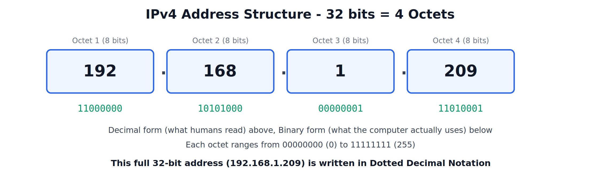
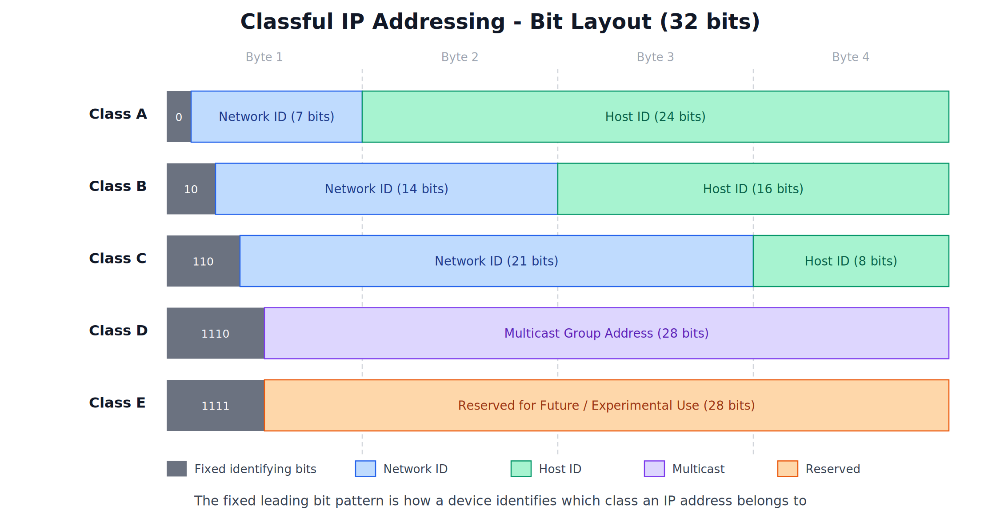
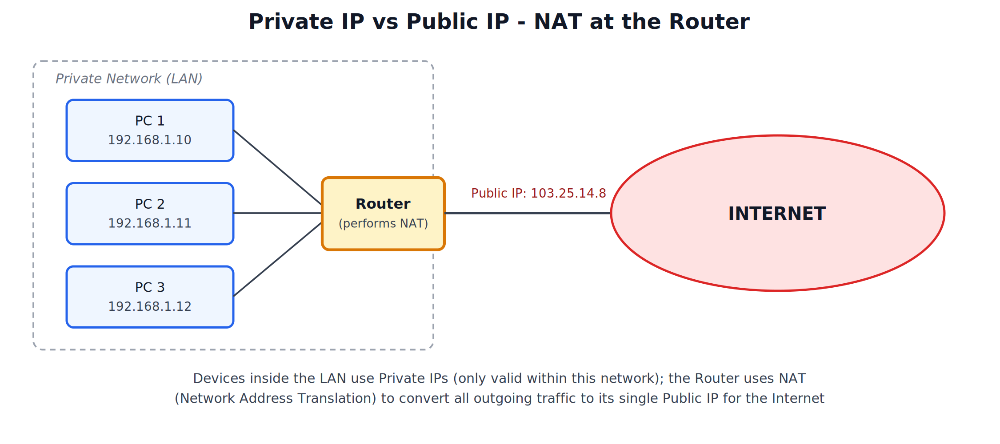

# IP Protocol, IP Address Scheme, and Classification

---

## 1. IP Protocol

### What is IP Protocol

IP (Internet Protocol) is the protocol responsible for **logical addressing** and **routing** of data packets from a source device to a destination device across interconnected networks. It defines how devices are identified on a network and how packets find their way from one network to another.

"The Internet Protocol is a network-layer protocol that assigns a unique logical address to every device on a network and handles the routing of data packets between networks."

### Role and Purpose

- Provides a unique **logical address** (the IP address) to every device connected to a network, so it can be identified and reached.
- Enables **routing** — determining the path a packet should take across multiple interconnected networks to reach its destination.
- Handles **fragmentation** of packets when required by the underlying network, and their reassembly at the destination.
- Operates on a **best-effort delivery** basis — IP itself does not guarantee delivery, ordering, or error correction; reliability is handled by the transport layer above it.

---

## 2. IP Address Scheme

### What is an IP Address

An IP address is a unique numerical label assigned to a device connected to a network, used to identify that device and enable communication with it.

An IPv4 address is **32 bits** long, divided into **4 sections of 8 bits each**, called **octets**. It is written in a human-readable form called **dotted decimal notation**, where each octet is converted to its decimal value (0-255) and separated by dots.

### Structure

Every IP address is logically divided into two parts:

| Part | Purpose |
|---|---|
| Network ID | Identifies which network the device belongs to |
| Host ID | Identifies the specific device within that network |

The split between how many bits belong to the Network ID and how many belong to the Host ID depends on the address's **class**, covered next.

---

## 3. Classful IP Addressing

To organize IP address allocation, IPv4 addresses were originally divided into five classes: A, B, C, D, and E. Each class reserves a fixed leading bit pattern, which is how a device identifies which class an address belongs to, and this pattern determines how the remaining bits are split between Network ID and Host ID.

### Class A

- Leading bit: `0`
- First octet range: **1 to 126**
- Network ID: 7 bits, Host ID: 24 bits
- Supports a small number of networks, but a very large number of hosts per network (over 16 million).
- Intended for very large organizations.

### Class B

- Leading bits: `10`
- First octet range: **128 to 191**
- Network ID: 14 bits, Host ID: 16 bits
- Supports a moderate number of networks and a moderate number of hosts per network (about 65,000).
- Intended for medium to large organizations.

### Class C

- Leading bits: `110`
- First octet range: **192 to 223**
- Network ID: 21 bits, Host ID: 8 bits
- Supports a very large number of networks, but only a small number of hosts per network (254).
- Intended for small organizations/networks.

### Class D

- Leading bits: `1110`
- First octet range: **224 to 239**
- Not split into Network/Host ID; the remaining 28 bits identify a **multicast group** — used for sending a single stream of data to multiple specific recipients at once (multicasting), rather than identifying an individual host.

### Class E

- Leading bits: `1111`
- First octet range: **240 to 255**
- Reserved for future use and experimental/research purposes; not used for general host addressing.

### Special Address Note

The address **127.x.x.x** (within the Class A range) is reserved as the **loopback address**, used by a device to refer to itself (commonly `127.0.0.1`), and is not assigned to any real network host.

### Consolidated Classful Range Table

| Class | First Octet Range | Leading Bits | Default Use |
|---|---|---|---|
| A | 1 - 126 | 0 | Very large networks (few networks, many hosts each) |
| B | 128 - 191 | 10 | Medium/large networks |
| C | 192 - 223 | 110 | Small networks (many networks, few hosts each) |
| D | 224 - 239 | 1110 | Multicasting |
| E | 240 - 255 | 1111 | Reserved / experimental |

---

## 4. Public IP vs Private IP Addresses

### Public IP Address

A **public IP address** is globally unique and routable directly over the Internet. No two devices on the public Internet can share the same public IP address at the same time. Public IPs are assigned by Internet Service Providers (ISPs) and regional Internet registries.

### Private IP Address

A **private IP address** is used only within a local, private network (such as a home or office LAN) and is not directly reachable from the public Internet. Because private IP ranges are not routed on the public Internet, the same private IP ranges can be reused independently inside millions of different private networks around the world without conflict.

### Reserved Private IP Ranges

| Class | Private Range |
|---|---|
| A | 10.0.0.0 - 10.255.255.255 |
| B | 172.16.0.0 - 172.31.255.255 |
| C | 192.168.0.0 - 192.168.255.255 |

### NAT - Network Address Translation

Since devices using private IPs cannot be reached directly from the Internet, a **router** performs **NAT (Network Address Translation)** — it translates the private IP addresses of internal devices into its own single public IP address whenever they communicate with the outside Internet, and translates responses back to the correct internal device.

"NAT is the process by which a router translates private IP addresses used within a local network into a single public IP address for communication over the Internet."

### Why This Matters

- NAT allows an entire private network, with potentially hundreds of devices, to share a single public IP address when accessing the Internet.
- It also adds a layer of security, since internal private IP addresses are never directly exposed to the outside Internet.
- This is exactly why the same private address like `192.168.1.1` can exist inside millions of different homes' routers simultaneously without any conflict — each is confined to its own private network.
