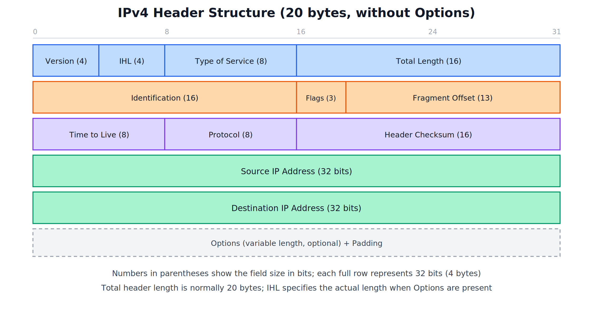
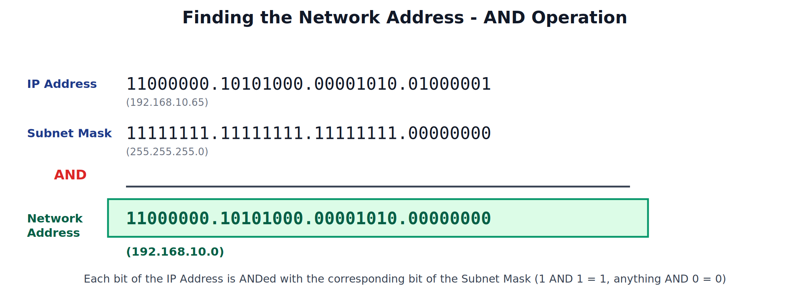

# IPv4 Header and Subnet Masking

---

## 1. IPv4 Header

### What is the IPv4 Header

Every IP packet carries a header in front of its data, containing all the control information a router or destination device needs to correctly handle, route, and reassemble the packet. The standard IPv4 header is **20 bytes** long (without any Options), organized as five rows of 32 bits each.

### Field by Field

**Version (4 bits)**
Indicates which version of the IP protocol is being used — set to 4 for IPv4.

**IHL - Internet Header Length (4 bits)**
Specifies the length of the header in units of 4-byte words. A standard header without Options has an IHL value of 5 (5 x 4 = 20 bytes).

**Type of Service (8 bits)**
Indicates the priority/quality-of-service requirements for the packet, such as whether it should be treated with low delay, high throughput, or high reliability.

**Total Length (16 bits)**
The total length of the entire IP packet (header + data) in bytes.

**Identification (16 bits)**
A unique value assigned to a packet, used to identify all the fragments belonging to the same original packet if it had to be fragmented.

**Flags (3 bits)**
Control flags related to fragmentation — one flag indicates whether the packet may be fragmented, and another indicates whether more fragments follow.

**Fragment Offset (13 bits)**
Indicates the position of a fragment within the original, unfragmented packet, allowing correct reassembly at the destination.

**Time to Live - TTL (8 bits)**
A counter that is decremented by 1 at every router (hop) the packet passes through. When it reaches zero, the packet is discarded — this prevents packets from circulating forever due to routing loops.

**Protocol (8 bits)**
Identifies which upper-layer protocol the data belongs to, such as TCP or UDP, so the destination knows how to hand off the data after removing the IP header.

**Header Checksum (16 bits)**
Used to detect errors in the header itself (not the data) during transmission; recalculated at every hop since the TTL field changes at each router.

**Source IP Address (32 bits)**
The IP address of the device that originally sent the packet.

**Destination IP Address (32 bits)**
The IP address of the intended recipient device.

**Options + Padding (variable, optional)**
Used for less common features such as security markings, route recording, or timestamps; padded with extra bits if needed so the header ends on a 32-bit boundary.

---

## 2. Subnet Masking

### What is a Subnet Mask

A subnet mask is a 32-bit number, written in the same dotted decimal format as an IP address, that is used to distinguish which portion of an IP address represents the **Network ID** and which portion represents the **Host ID**.

In a subnet mask, bits set to `1` represent the Network portion, and bits set to `0` represent the Host portion.

### Default Subnet Masks by Class

| Class | Default Subnet Mask | Network Bits | Host Bits |
|---|---|---|---|
| A | 255.0.0.0 | 8 | 24 |
| B | 255.255.0.0 | 16 | 16 |
| C | 255.255.255.0 | 24 | 8 |

### Why Subnetting is Used

- Allows a large network to be divided into smaller, more manageable **sub-networks (subnets)**.
- Reduces network congestion by limiting broadcast traffic to smaller segments rather than one massive network.
- Improves security, since subnets can be isolated from each other and controlled independently.
- Allows more efficient use of the available address space, avoiding waste from assigning an entire large classful network when only a small number of hosts are actually needed.

---

## 3. Finding the Network Address - The AND Operation

To determine which network a given IP address belongs to, the device performs a bitwise **AND** operation between the IP address and the subnet mask. Each bit of the IP address is ANDed with the corresponding bit of the subnet mask, following simple binary AND rules: `1 AND 1 = 1`, and anything AND `0 = 0`.

### Worked Example

Given an IP address of **192.168.10.65** with a subnet mask of **255.255.255.0**:

1. Convert both the IP address and the subnet mask to binary.
2. Perform a bitwise AND operation between them, octet by octet.
3. Convert the resulting binary value back to decimal.

The result, **192.168.10.0**, is the **Network Address** — it identifies the network itself, while the remaining host bits (all zero in the network address) are used to number the individual devices within that network.

### What This Tells a Device

- Any two IP addresses that produce the same result after this AND operation belong to the **same network**, and can communicate directly without needing to be routed through a gateway.
- If the result differs, the devices are on **different networks**, and traffic between them must be forwarded through a router.
