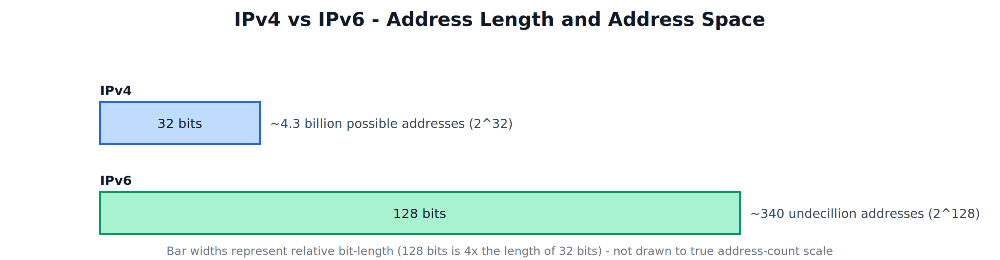
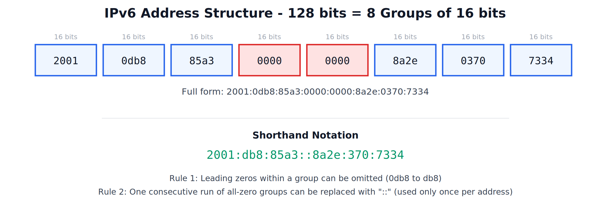
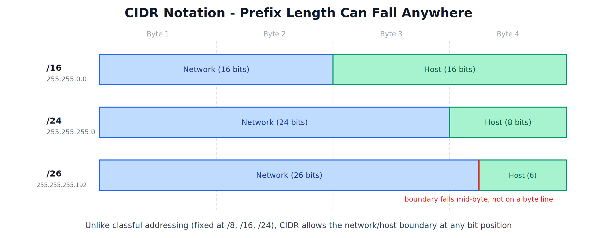

# IPv6 and CIDR Notation

---

## 1. Why IPv6 is Needed

### The IPv4 Address Exhaustion Problem

An IPv4 address is 32 bits long, which allows for a maximum of about 4.3 billion unique addresses. When IPv4 was designed, this seemed like an enormous number. Today, with billions of smartphones, laptops, servers, and an ever-growing number of IoT devices (smart TVs, sensors, appliances, wearables) all needing their own address, this address space has effectively run out.



### Contributing Factors

- Explosive growth in the number of Internet-connected devices, far beyond what was anticipated when IPv4 was designed.
- Inefficient allocation in the early classful addressing days, where large blocks of addresses were handed out to organizations that did not need anywhere close to that many.
- The rise of the Internet of Things (IoT), where even small everyday devices now need a unique network address.

### The Solution: IPv6

IPv6 was designed with a **128-bit** address space, which provides approximately 340 undecillion (340 followed by 36 zeros) unique addresses — a number large enough that address exhaustion is not expected to be a practical concern for the foreseeable future.

---

## 2. IPv6 Address Structure

An IPv6 address is 128 bits long, written as **8 groups of 16 bits each**, with each group represented in **hexadecimal** (base 16) and separated by colons.



### Full Form Example

```
2001:0db8:85a3:0000:0000:8a2e:0370:7334
```

### Shorthand Notation Rules

To make these long addresses easier to read and write, two shortening rules are allowed:

1. **Omit leading zeros** within any single group — `0db8` can be written as `db8`.
2. **Replace one consecutive run of all-zero groups with a double colon `::`** — this can only be used once in a given address, since using it more than once would make the address ambiguous (there would be no way to know how many zero groups each `::` represents).

Applying both rules, the example address above becomes:

```
2001:db8:85a3::8a2e:370:7334
```

---

## 3. IPv4 vs IPv6 Comparison

| Parameter | IPv4 | IPv6 |
|---|---|---|
| Address Length | 32 bits | 128 bits |
| Address Format | Dotted decimal (e.g., 192.168.1.1) | Colon-separated hexadecimal (e.g., 2001:db8::1) |
| Total Addresses | About 4.3 billion | About 340 undecillion |
| Header Complexity | More fields, includes checksum | Simplified, fixed-size header, no header checksum |
| Configuration | Often manual or via DHCP | Supports automatic address configuration natively |
| Security | Security (IPSec) is optional, added separately | Built-in support for IPSec by design |
| Fragmentation | Can be performed by routers along the path | Only performed by the sending device, not intermediate routers |
| Current Status | Still widely used, but address space exhausted | Gradually being adopted to solve the exhaustion problem |

---

## 4. CIDR Notation

### What is CIDR

CIDR (Classless Inter-Domain Routing) is a method of IP addressing that replaced the older rigid classful system (Class A, B, C, with fixed network/host boundaries at 8, 16, or 24 bits). CIDR allows the boundary between the Network ID and Host ID to be placed at **any bit position**, not just at fixed byte boundaries.

### CIDR Notation Format

An address is written together with a **prefix length**, indicated by a forward slash followed by a number, representing how many leading bits belong to the Network ID.

```
192.168.10.0/24
```

This means the first 24 bits are the Network ID, and the remaining 8 bits are the Host ID — equivalent to a subnet mask of 255.255.255.0.



### Why CIDR is More Flexible than Classful Addressing

As shown above, a `/24` network aligns exactly on a byte boundary, matching the old Class C default. But a `/26` network places the Network/Host boundary in the middle of the fourth byte — something the old classful system could never do, since it only allowed boundaries at 8, 16, or 24 bits.

This flexibility allows network administrators to size a network to match the actual number of hosts needed, rather than being forced to use an entire Class A, B, or C block regardless of actual requirement — significantly reducing address wastage.

### Reading CIDR Prefixes

| CIDR Prefix | Subnet Mask | Network Bits | Host Bits | Approx. Usable Hosts |
|---|---|---|---|---|
| /16 | 255.255.0.0 | 16 | 16 | ~65,000 |
| /24 | 255.255.255.0 | 24 | 8 | 254 |
| /26 | 255.255.255.192 | 26 | 6 | 62 |
| /30 | 255.255.255.252 | 30 | 2 | 2 |

A larger prefix number means more Network bits and fewer Host bits, resulting in a smaller network (fewer usable host addresses) — and vice versa for a smaller prefix number.
