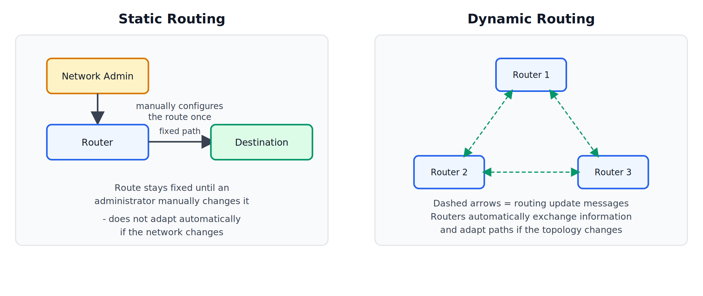
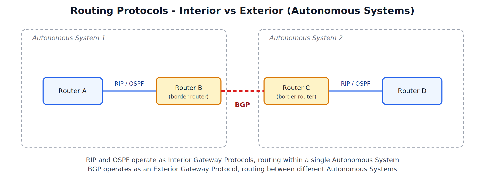

# Routing, Routing Protocols

---

## 1. Routing

### What is Routing

Routing is the process of selecting a path across one or more interconnected networks for data packets to travel from a source device to a destination device. A router examines the destination address of each incoming packet and consults its routing table to decide which outgoing link to forward the packet toward.

"Routing is the process by which a router determines the best available path for forwarding a packet toward its destination network."

### Why Routing is Needed

- Networks are made up of many smaller networks connected together; a packet often has to cross several intermediate networks to reach its destination.
- Without routing, a router would have no way of knowing which direction to send a packet that isn't addressed to a directly connected device.
- Good routing decisions directly affect network performance — choosing a congested or unnecessarily long path increases delay.

---

## 2. Static Routing vs Dynamic Routing

Routing tables can be built in two fundamentally different ways.

### Static Routing

In static routing, a network administrator manually enters each route into a router's routing table. The route remains fixed and does not change automatically, even if the network topology changes (for example, if a link goes down).

**Advantages**: Simple, predictable, uses no extra bandwidth for route calculation, and gives the administrator full control.

**Disadvantages**: Does not scale well to large networks, requires manual reconfiguration whenever the network changes, and cannot automatically route around a failure.

### Dynamic Routing

In dynamic routing, routers run a routing protocol that automatically exchanges information with neighboring routers, allowing them to build and continuously update their routing tables on their own, adapting to changes in the network.

**Advantages**: Automatically adapts to network changes and failures, scales well to large and complex networks, and reduces the administrative burden of manual configuration.

**Disadvantages**: More complex to set up and understand, consumes some bandwidth and processing power for routers to exchange routing information, and can take time to "converge" (all routers agreeing on the current best paths) after a change.

---

## 3. Routing Protocols

A routing protocol defines the rules routers use to share information with each other and calculate the best path to a destination. Routing protocols are broadly classified based on where they operate.

### Autonomous System

An Autonomous System (AS) is a large network or group of networks under the administrative control of a single organization (for example, a large ISP or a university network), which presents a common routing policy to the rest of the Internet.

### Interior Gateway Protocols (IGP)

Used for routing **within** a single Autonomous System.

**RIP (Routing Information Protocol)**
A simple, older distance-vector protocol that chooses the best path based on **hop count** (the number of routers a packet must pass through). Easy to configure, but does not scale well to large networks and converges slowly after a change.

**OSPF (Open Shortest Path First)**
A more advanced link-state protocol that considers factors like bandwidth to calculate the shortest and most efficient path, rather than relying only on hop count. Converges faster than RIP and scales much better to large networks.

### Exterior Gateway Protocol (EGP)

Used for routing **between** different Autonomous Systems.

**BGP (Border Gateway Protocol)**
The protocol that connects and routes traffic between the many independent Autonomous Systems that together make up the Internet. It focuses on policy-based routing decisions (such as business agreements between ISPs), rather than purely selecting the mathematically shortest path.

---
