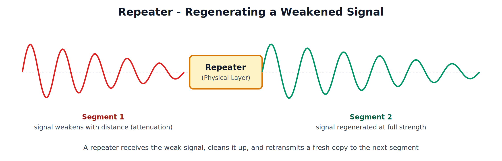
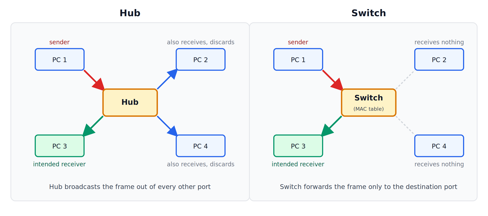
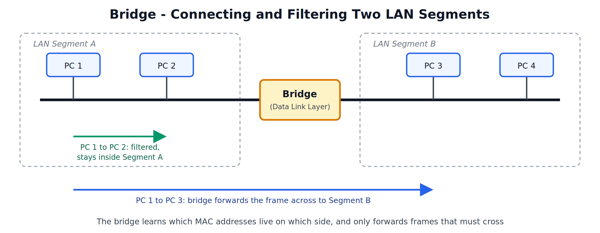

# Network Devices and Flow Control
## Network Devices: Repeater, Hub, Bridge, and Switch

---

## 1. Role of Network Devices

Network devices are the hardware units that connect computers and networks together and control how data moves between them. Each device works at a particular layer of the network model, and the layer decides what the device can "see" in the data it handles:

- A device working at the **Physical layer** only sees raw signals and bits.
- A device working at the **Data Link layer** can read the frame and its MAC addresses.
- A device working at the **Network layer** can read the packet and its IP addresses.

Two terms are needed to compare devices properly:

**Collision Domain**: a network segment in which two devices sending at the same time will cause a collision. Fewer devices per collision domain means fewer collisions.

**Broadcast Domain**: the group of devices that all receive a broadcast frame sent by any one of them.

---

## 2. Repeater

### What is a Repeater

A repeater is a two-port device that receives a weakened signal, regenerates it, and retransmits it to the next cable segment. It works at the **Physical layer**.

### Why it is Needed

As a signal travels along a cable it loses strength (attenuation). Every cable type has a maximum segment length beyond which the signal can no longer be read correctly. A repeater placed before that limit rebuilds the signal at full strength, so the network can extend past the single-segment limit.

### Key Points

- Regenerates the signal (cleans and retransmits it), which is different from a plain amplifier that boosts the signal together with any noise on it.
- Does not read addresses and does not filter anything; every signal it receives is passed on.
- Connects two segments of the **same** LAN, using the same protocol and access method.
- Both segments remain a single collision domain.

### Limitation

Repeaters cannot reduce traffic or collisions. They only extend distance. The number of repeaters that can be chained is also limited because each one adds a small delay.

---

## 3. Hub

### What is a Hub

A hub is a multiport repeater. It has several ports, and any frame received on one port is copied out of **all the other ports**. It works at the **Physical layer**.

### Working

1. PC 1 sends a frame to PC 3 through the hub.
2. The hub does not look at the destination address. It simply repeats the frame on every other port.
3. PC 2, PC 3 and PC 4 all receive it. PC 3 accepts it because the destination MAC matches; PC 2 and PC 4 discard it.

### Types of Hubs

| Type | Description |
|---|---|
| Passive Hub | Only connects the cables; does not regenerate the signal and needs no power |
| Active Hub | Regenerates the signal before sending it out, like a multiport repeater; needs power |
| Intelligent Hub | An active hub with extra features such as management and monitoring |

### Key Points

- All ports share the same bandwidth. If the hub is 10 Mbps, all connected devices together share those 10 Mbps.
- Works in half duplex only: a port cannot send and receive at the same time.
- The whole hub is one collision domain and one broadcast domain, so collisions rise quickly as devices are added.
- No security: every device on the hub receives every frame.
- Used in a star topology; largely replaced by switches today.

---

## 4. Bridge

### What is a Bridge

A bridge connects two LAN segments and forwards frames between them based on **MAC addresses**. It works at the **Data Link layer**.

### Working

A bridge keeps a table of MAC addresses and the segment each one is on. It builds this table on its own by watching the source address of every frame it sees (called **learning**).

- If the sender and receiver are on the same segment (PC 1 to PC 2), the bridge **filters** the frame and does not pass it to the other segment.
- If the receiver is on the other segment (PC 1 to PC 3), the bridge **forwards** the frame across.
- If the destination is not yet in the table, the bridge forwards the frame to the other segment, and learns the location when a reply arrives.

### Key Points

- Divides a LAN into separate collision domains, so traffic inside one segment does not disturb the other.
- Reduces unnecessary traffic compared with a hub or repeater.
- Usually has only 2 ports and is mostly software-based, so it is slower than a switch.
- Both segments are still in the same broadcast domain, since broadcast frames are forwarded.
- Can connect LAN segments that use different types of media, as long as they use the same higher-layer addressing.

---

## 5. Switch

### What is a Switch

A switch is a multiport bridge. It connects many devices in a LAN and forwards each frame only to the port where the destination device is connected. It works at the **Data Link layer**.

In the hub-vs-switch diagram above, the frame from PC 1 goes only to PC 3 through a switch. PC 2 and PC 4 do not receive it at all.

### The MAC Address Table

A switch keeps a table mapping each MAC address to the port it was learned on.

| MAC Address | Port |
|---|---|
| AA:AA:AA:AA:AA:01 | 1 |
| AA:AA:AA:AA:AA:02 | 2 |
| AA:AA:AA:AA:AA:03 | 3 |
| AA:AA:AA:AA:AA:04 | 4 |

### Working of a Switch

1. **Learning**: when a frame arrives, the switch reads the source MAC address and records it against the incoming port.
2. **Lookup**: it reads the destination MAC address and searches the table.
3. **Forwarding**: if the destination is found on a different port, the frame is sent only out of that port.
4. **Flooding**: if the destination is not in the table (or is a broadcast), the frame is sent out of all ports except the one it arrived on.
5. **Filtering**: if the destination is on the same port the frame came from, the frame is dropped.

### Key Points

- Every port is its own collision domain, so collisions are eliminated on switched links.
- Each port gets dedicated bandwidth instead of sharing it.
- Supports full duplex, so a device can send and receive at the same time.
- Switching is done in hardware, which makes it much faster than a bridge.
- All ports are still in one broadcast domain unless VLANs are configured.
- More secure than a hub, since frames are not copied to every device.
- Some switches (Layer 3 switches) can also route using IP addresses.

---

## 6. Comparison of Repeater, Hub, Bridge, and Switch

| Parameter | Repeater | Hub | Bridge | Switch |
|---|---|---|---|---|
| Layer | Physical | Physical | Data Link | Data Link |
| Number of Ports | 2 | Multiple | Usually 2 | Multiple |
| Data Handled | Signals / bits | Signals / bits | Frames | Frames |
| Uses MAC Address | No | No | Yes | Yes |
| Sends Data To | The next segment | All other ports | Only the needed segment | Only the destination port |
| Collision Domains | One | One | One per segment | One per port |
| Broadcast Domain | One | One | One | One (without VLANs) |
| Duplex | Half | Half | Half or Full | Full |
| Main Purpose | Extend distance | Connect many devices (shared) | Split and connect LAN segments | Connect many devices (dedicated) |
