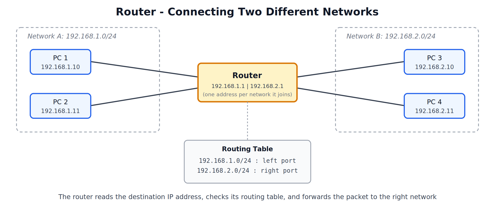
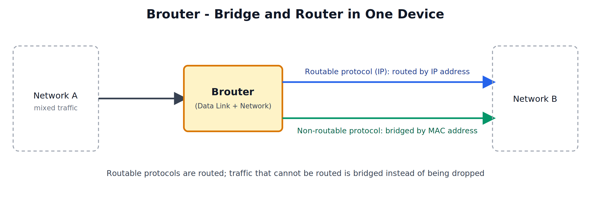
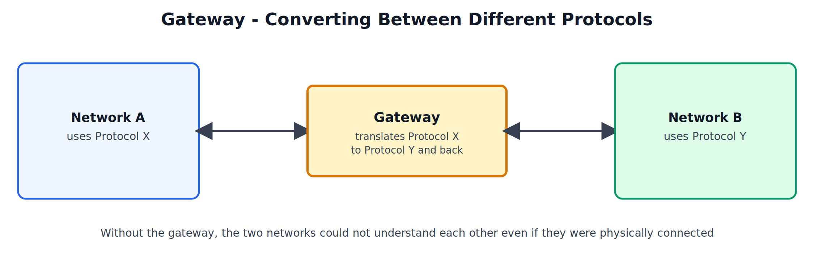
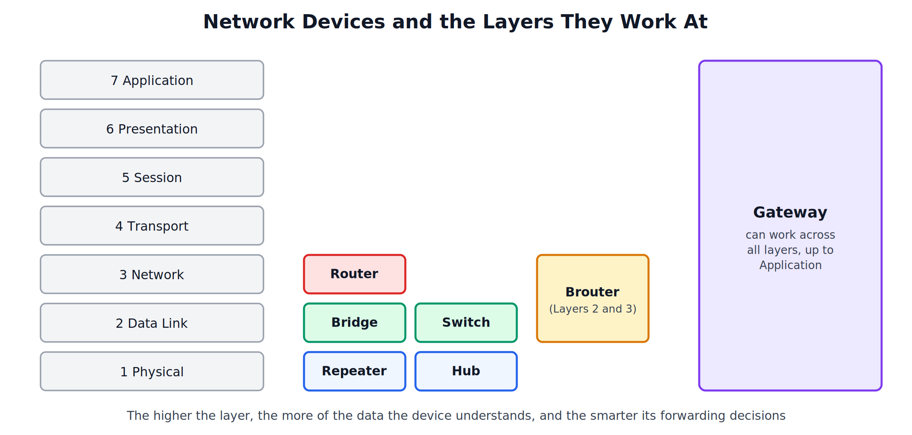
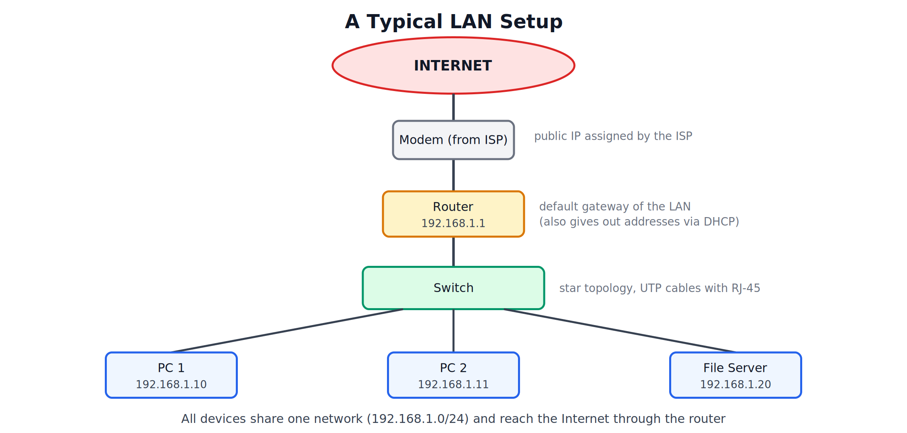

## Router, Brouter, Gateway, Device Comparison, and LAN Implementation

---

## 1. Router

### What is a Router

A router is a device that connects two or more different networks and forwards data packets between them using **IP addresses**. It works at the **Network layer**.

### Working

1. A packet arrives on one of the router's interfaces.
2. The router reads the **destination IP address** in the packet header.
3. It looks up that address in its **routing table**, which lists each known network and the interface (or next router) that leads to it.
4. It forwards the packet out of the matching interface, choosing the best available path.
5. If no matching route exists, the packet is sent to the **default route** (usually towards the Internet) or dropped.

### Routing Table

The routing table can be filled in manually (static routing) or automatically by routing protocols such as RIP, OSPF and BGP (dynamic routing).

### Key Points

- Each interface of a router belongs to a different network, and has an IP address in that network.
- Separates broadcast domains: a broadcast sent in one network is not forwarded to another.
- The router's interface address on a LAN is the **default gateway** that the LAN's devices use to reach other networks.
- Can also provide extra functions such as NAT, DHCP, and basic packet filtering (firewall).
- Slower than a switch because it inspects Layer 3 information, but it is what makes communication between networks possible.

---

## 2. Brouter

### What is a Brouter

A brouter (bridge + router) is a device that combines the functions of a bridge and a router. It works at both the **Data Link layer and the Network layer**.

### Working

- For **routable protocols** (such as IP), it behaves like a router and forwards packets using IP addresses.
- For **non-routable protocols** (protocols that have no network-layer address to route with), it behaves like a bridge and forwards frames using MAC addresses.

A plain router would have to drop non-routable traffic. A brouter passes it along by bridging it.

### Key Points

- Useful in networks that carry a mix of routable and non-routable protocols.
- Can also filter traffic like a bridge, which reduces load between segments.
- More costly and complex than a bridge or a router alone.
- Rarely needed today, since almost all traffic now uses IP and modern routers and switches cover both jobs.

---

## 3. Gateway

### What is a Gateway

A gateway is a device that connects two networks that use **different protocols or architectures**, and converts data from the format of one network into the format of the other. It can work at **any layer up to the Application layer**.

### Working

A router only passes packets between networks that speak the same protocol family. When the two networks understand different protocols, the gateway receives the data, unwraps it, translates it into the other network's format, and sends it on. It does this in both directions.

### Examples

| Type | What it converts |
|---|---|
| Protocol gateway | Between two different network protocol suites |
| E-mail gateway | Between two different mail systems / message formats |
| VoIP gateway | Between the telephone network and an IP (Internet) network |
| Default gateway | The router address a device sends traffic to when the destination is outside its own network |

### Key Points

- The most complex and slowest of all network devices, since it translates the data instead of just forwarding it.
- Can be a dedicated hardware device or software running on a computer.
- The term "gateway" is also used informally for the router that leads out of a LAN (the default gateway).

---

## 4. Comparison of All Network Devices

| Device | Layer | Data Unit | Address Used | Main Function |
|---|---|---|---|---|
| Repeater | Physical | Signal / bits | None | Regenerate the signal to extend distance |
| Hub | Physical | Signal / bits | None | Connect many devices; repeats data to all ports |
| Bridge | Data Link | Frame | MAC address | Connect and filter between two LAN segments |
| Switch | Data Link | Frame | MAC address | Connect many devices; forward only to the destination port |
| Router | Network | Packet | IP address | Connect different networks and choose the best path |
| Brouter | Data Link + Network | Frame and packet | MAC and IP address | Route routable traffic and bridge the rest |
| Gateway | Up to Application | Data | Protocol dependent | Convert between different protocols or architectures |

### Domain Behaviour

| Device | Collision Domain | Broadcast Domain |
|---|---|---|
| Repeater | Extends the same one | Same one |
| Hub | One for all ports | One for all ports |
| Bridge | Separates them per segment | Same one |
| Switch | Separates them per port | Same one (without VLANs) |
| Router | Separates them | Separates them per network |

### Choosing a Device

| Requirement | Suitable Device |
|---|---|
| Extend a cable beyond its distance limit | Repeater |
| Connect many computers inside one LAN | Switch |
| Split a busy LAN into two segments | Bridge (or switch) |
| Connect a LAN to another network or the Internet | Router |
| Connect networks that use different protocols | Gateway |

---

## 5. LAN Implementation and Requirements

A Local Area Network (LAN) connects computers, printers and servers within a limited area such as a lab, office or building. Setting one up needs hardware, software, and an addressing plan.

### Hardware Requirements

| Component | Purpose |
|---|---|
| End devices (PCs, servers, printers) | The devices that use the network |
| Network Interface Card (NIC) | Lets each device connect to the network; every device needs one |
| Cables and connectors | UTP cable (Cat5e or Cat6) with RJ-45 connectors for a wired LAN |
| Switch | Central device that connects all the devices in a star topology |
| Router | Connects the LAN to other networks and the Internet; acts as the default gateway |
| Modem | Connects the LAN to the ISP (often built into the router) |
| Wireless Access Point | Optional; adds Wi-Fi access for wireless devices |

### Software Requirements

- An operating system with networking support on every device.
- A protocol stack, normally TCP/IP.
- Network services where needed, such as DHCP (automatic addresses), DNS (name resolution), and file or print sharing.

### Addressing Requirements

Each device on the LAN needs the following settings:

| Setting | Example | Purpose |
|---|---|---|
| IP address | 192.168.1.10 | Unique address of the device in the LAN |
| Subnet mask | 255.255.255.0 | Separates the network part from the host part |
| Default gateway | 192.168.1.1 | Router address used to reach other networks |
| DNS server | 8.8.8.8 | Converts domain names to IP addresses |

### Steps to Set Up a LAN

1. **Plan**: decide how many devices will be connected, where they will be placed, and choose a topology (star is the standard choice).
2. **Select equipment**: choose the switch (with enough ports), cables, and a router if Internet or another network is needed.
3. **Install the hardware**: fit a NIC in every device that lacks one, and place the switch and router.
4. **Connect the cables**: run a UTP cable from each device to a switch port, and from the switch to the router.
5. **Assign IP addresses**: either give each device a static address, or turn on DHCP on the router so addresses are handed out automatically. All devices must be in the same network (same network part, same subnet mask).
6. **Configure the router**: set its LAN address (the default gateway), enable DHCP, and connect its WAN side to the ISP.
7. **Test connectivity**: use the `ping` command between devices, and to the default gateway, to confirm the network works.
8. **Share resources and secure the network**: set up file and printer sharing, user accounts and passwords, and, where needed, firewall rules.
