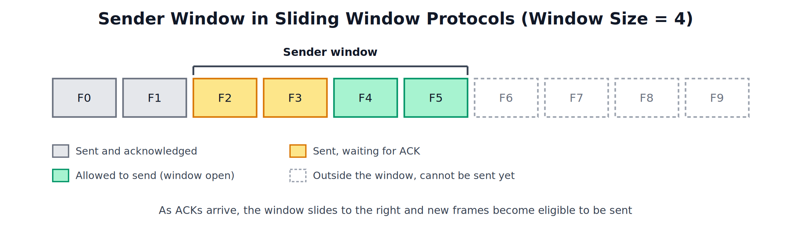
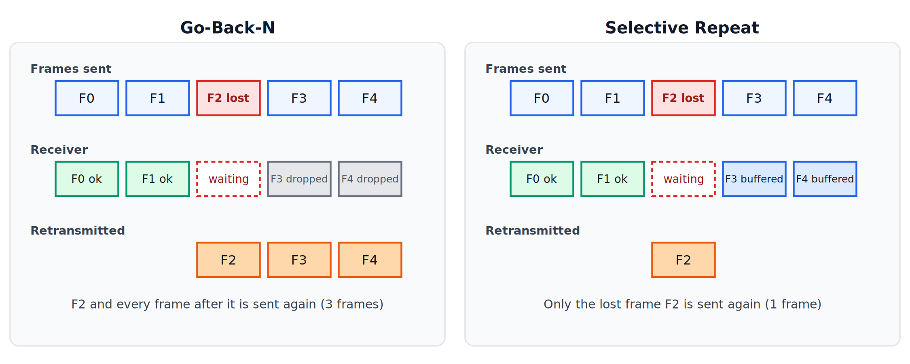
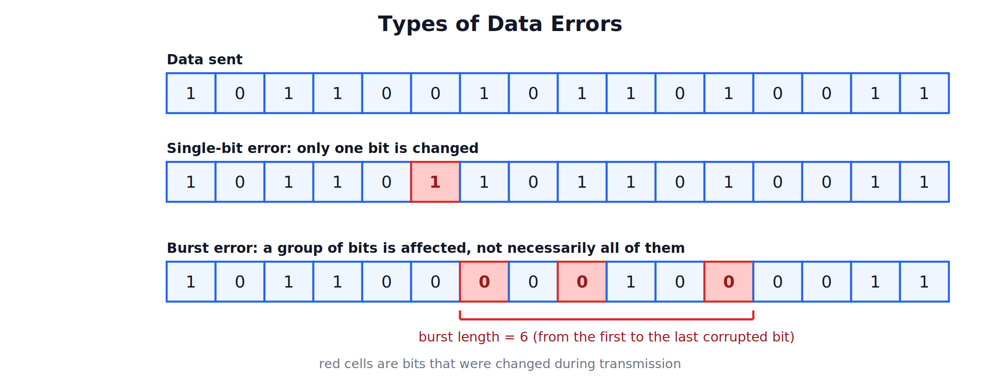
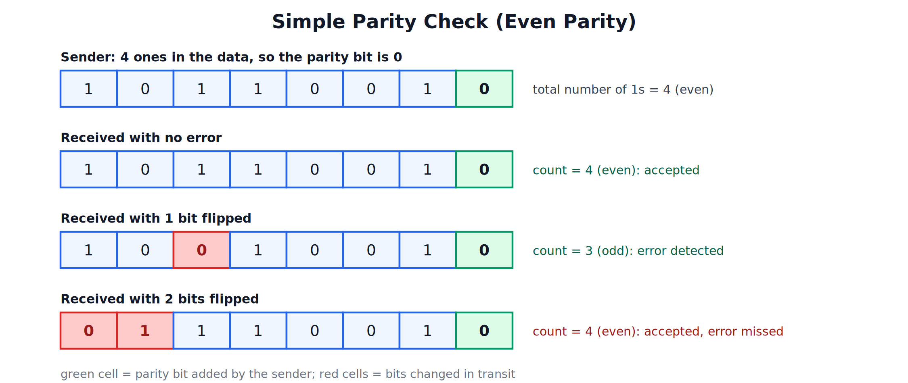
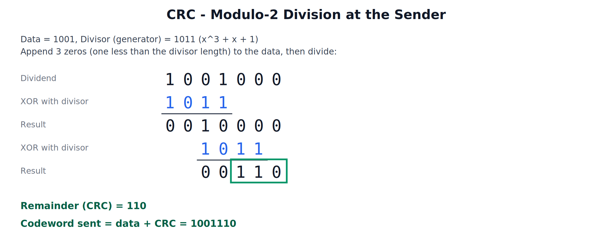

## Flow Control, Data Errors, and Error Detection

---

## 1. Flow Control

### What is Flow Control

Flow control is the set of methods that stop a fast sender from sending data faster than the receiver can accept and process it. Without it, the receiver's buffer fills up and frames are lost.

Most flow control methods work with **acknowledgements (ACKs)**: the receiver tells the sender which frames arrived correctly, and the sender decides what to send next. If an ACK does not arrive within a set time, a **timer** expires and the sender retransmits. Methods that combine flow control with retransmission on error are called **ARQ (Automatic Repeat reQuest)** methods.

### Flow Control Techniques

| Technique | Idea |
|---|---|
| Stop-and-Wait | Send one frame, wait for its ACK, then send the next |
| Sliding Window | Send several frames before waiting for ACKs |
| Go-Back-N | Sliding window; on an error, resend the bad frame and all frames after it |
| Selective Repeat | Sliding window; on an error, resend only the bad frame |

---

## 2. Stop-and-Wait

The sender transmits a single frame and stops. It sends the next frame only after the ACK for the current one arrives. If the ACK does not arrive before the timer expires, the same frame is sent again.

- **Sender window size**: 1, **receiver window size**: 1.
- Simple to implement and needs very little buffer space.
- Very inefficient: the link sits idle while the sender waits for each ACK, and the loss is worst on long or fast links where the ACK takes a long time to return.

---

## 3. Sliding Window

### Concept

Frames are given sequence numbers. The sender may transmit up to a fixed number of frames, called the **window size**, without waiting for an ACK. As ACKs arrive, the window slides forward and new frames become eligible to be sent.

In the diagram, F0 and F1 are already acknowledged, F2 and F3 have been sent and are waiting for their ACKs, and F4 and F5 can be sent immediately. F6 onwards must wait until the window slides.

### Sequence Numbers and Window Size

If **m** bits are used for the sequence number, sequence numbers run from 0 to 2^m - 1 and then repeat. The window size must stay below the number of sequence numbers, otherwise the receiver cannot tell a new frame from a retransmitted old one.

### Advantage

Several frames are in transit at once, so the link is kept busy and throughput is much higher than with Stop-and-Wait. With a window size of 1, sliding window behaves exactly like Stop-and-Wait.

Sliding window is implemented in two ways, depending on how errors are handled: Go-Back-N and Selective Repeat.

---

## 4. Go-Back-N and Selective Repeat

### Go-Back-N

- The **sender window** can be up to 2^m - 1 frames; the **receiver window** is 1, so the receiver accepts frames only in order.
- The receiver sends cumulative ACKs (an ACK for frame n means all frames up to n arrived correctly).
- If frame 2 is lost, the receiver discards frames 3 and 4 because they are out of order. The sender's timer for frame 2 expires, and it goes back and resends **frame 2 and every frame after it**.
- Simple receiver and little buffering, but bandwidth is wasted resending frames that had actually arrived.

### Selective Repeat

- The **sender window and receiver window** can each be up to 2^(m-1) frames.
- The receiver accepts out-of-order frames and holds them in a buffer, then delivers everything to the upper layer in the correct order once the missing frame arrives.
- If frame 2 is lost, frames 3 and 4 are buffered, and the sender resends **only frame 2**.
- Uses bandwidth efficiently, but the receiver needs buffer space and the logic to reorder frames, so it is more complex.

### Comparison of Flow Control Techniques

| Parameter | Stop-and-Wait | Go-Back-N | Selective Repeat |
|---|---|---|---|
| Sender window size | 1 | Up to 2^m - 1 | Up to 2^(m-1) |
| Receiver window size | 1 | 1 | Up to 2^(m-1) |
| Frames in transit | 1 | Several | Several |
| Frames resent on an error | The one frame | The bad frame and all after it | Only the bad frame |
| Receiver buffering out-of-order frames | No | No (discarded) | Yes |
| Bandwidth efficiency | Low | Moderate | High |
| Complexity | Lowest | Moderate | Highest |

---

## 5. Data Errors

### Why Errors Occur

When data travels over a medium, it can be altered by noise, interference, crosstalk from neighbouring wires, and attenuation. As a result, a bit sent as 0 may arrive as 1, or the reverse. Every network must therefore be able to detect that a frame has been corrupted.

### Types of Errors

**Single-bit error**: only one bit of the data unit is changed (0 to 1 or 1 to 0). This is the least common type in serial transmission, because noise usually lasts longer than one bit time.

**Burst error**: two or more bits of the data unit are changed. The **burst length** is measured from the first corrupted bit to the last corrupted bit, and it includes the bits in between even if some of them arrived correctly. In the diagram the burst length is 6, although only 3 bits actually changed. Burst errors are more common than single-bit errors, and the number of bits affected depends on the data rate and the duration of the noise.

---

## 6. Error Detection

### Basic Idea: Redundancy

To detect errors, the sender adds extra bits, called **redundant bits**, to the data. These bits are calculated from the data itself. The receiver repeats the same calculation on what it received and compares. If the result does not match, an error is reported and the frame is discarded or retransmitted.

Error detection only tells that something went wrong. It does not say which bit is wrong. The common methods are parity check, checksum, and CRC.

### 6.1 Parity Check

One extra bit, the **parity bit**, is added to each data unit so that the total number of 1s becomes even (**even parity**) or odd (**odd parity**).

**Working (even parity)**:
1. The sender counts the 1s in the data. The data 1011001 has four 1s, so the parity bit is 0 and the total stays even.
2. The receiver counts the 1s in the received unit, including the parity bit.
3. If the count is even, the unit is accepted. If it is odd, an error is reported.

**Strength**: detects every single-bit error, and any error that changes an odd number of bits.

**Weakness**: if an even number of bits change (for example, two bits), the count is still even and the error is missed, as shown in the last row of the diagram.

**Two-dimensional parity** improves this. The data is arranged in rows, a parity bit is computed for every row and for every column, and an extra parity row is sent with the data. It catches most burst errors and can even locate a single-bit error (the row and column that fail), but it still misses some patterns.

### 6.2 Checksum

The data is divided into equal-sized words (for example 8 bits or 16 bits). The words are added, and the complement of the sum is sent as the checksum.

**Sender**:
1. Divide the data into words of k bits.
2. Add all the words using **one's complement addition**: if the sum has a carry beyond k bits, the carry is added back to the result (wrapped around).
3. Complement the sum (change every 0 to 1 and every 1 to 0). This is the checksum.
4. Send the data words followed by the checksum.

**Receiver**:
1. Add all the received words, including the checksum, with one's complement addition.
2. Complement the result.
3. If the final result is all 0s, the data is accepted; otherwise it is rejected.

**Worked example (8-bit words)**

| Word | Value |
|---|---|
| Word 1 | 10110011 |
| Word 2 | 01101101 |
| Word 3 | 11001010 |
| Word 4 | 00110101 |

| Step | Calculation | Result |
|---|---|---|
| 1 | 10110011 + 01101101 = 100100000 (9 bits), carry wrapped: 00100000 + 1 | 00100001 |
| 2 | 00100001 + 11001010 | 11101011 |
| 3 | 11101011 + 00110101 = 100100000 (9 bits), carry wrapped: 00100000 + 1 | 00100001 |
| Sum | | 00100001 |
| Checksum (complement of sum) | | 11011110 |

The sender transmits the four words followed by 11011110.

At the receiver, the five words add up to 11111111. The complement of that is 00000000, so the data is accepted.

**Use**: the checksum is used in the IP, TCP and UDP headers.

### 6.3 Cyclic Redundancy Check (CRC)

CRC treats the data as a long binary number and divides it by a fixed binary number called the **generator** (or divisor), using modulo-2 division (XOR instead of subtraction). The remainder is sent along with the data.

**Sender**:
1. Choose the generator. A generator of n + 1 bits produces a CRC of n bits. Here the generator is 1011 (x^3 + x + 1), so the CRC has 3 bits.
2. Append n zeros to the data. Here 1001 becomes 1001000.
3. Divide by the generator using modulo-2 division. Wherever the leading bit is 1, XOR the generator in; where it is 0, skip the step.
4. The remainder is the CRC. Here it is 110.
5. Send the data followed by the CRC: the codeword 1001110.

**Receiver**:
1. Divide the whole received codeword by the same generator.
2. If the remainder is all 0s, the data is accepted. Any non-zero remainder means an error.

**Strength**: detects all single-bit errors, all burst errors no longer than the CRC length, and most longer bursts. This is why CRC is the most widely used method. Ethernet uses a 32-bit CRC in the trailer of every frame to detect corruption.

### Comparison of Error Detection Methods

| Method | Redundancy Added | Detects | Weakness | Typical Use |
|---|---|---|---|---|
| Simple Parity | 1 bit per data unit | Single-bit errors and any odd number of bit errors | Misses an even number of bit errors | Simple serial character transmission |
| Two-dimensional Parity | Row and column parity bits | Single-bit errors and most burst errors | Misses some patterns of flipped bits | Block data with simple hardware |
| Checksum | One word (commonly 16 bits) | Most single-bit and many burst errors | Errors that cancel out in the sum go unnoticed | IP, TCP and UDP headers |
| CRC | Remainder of n bits | All single-bit errors, bursts up to n bits, most longer bursts | Needs more computation than parity | Ethernet frames, Wi-Fi, storage devices |
