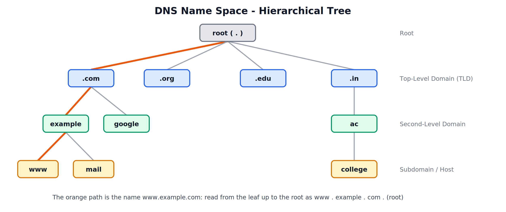
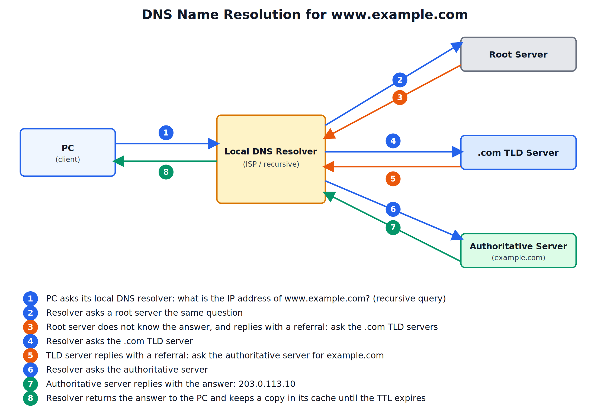
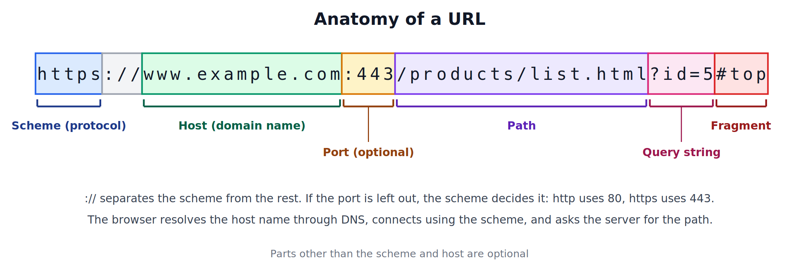

# The Application Layer
## DNS, DNS Name Space, Resource Records, Name Servers, and URL

---

## 1. Need for DNS

Computers find each other using IP addresses, but people remember names such as `www.example.com` far more easily than numbers such as `203.0.113.10`. The **Domain Name System (DNS)** is the Internet's naming service: it translates a host name into its IP address (and the reverse).

- DNS is an **application layer** protocol.
- It is a **distributed, hierarchical database**. No single server holds every name; the work is split across millions of servers.
- It normally uses **UDP port 53** for queries and answers. TCP port 53 is used when a response is too large for one UDP packet and for zone transfers between servers.

### Why a Distributed System

In the early Internet, all names lived in a single file that every computer copied. As the network grew, one central file became impossible to keep up to date, and one server could not handle all the requests. DNS solves this by dividing the names into a hierarchy and giving each part to a different server, which makes it scalable, fast, and free of a single point of failure.

---

## 2. DNS Name Space

The name space is the complete set of names that DNS can hold, and how those names are organised.

### Flat vs Hierarchical Name Space

| Type | Description | Problem or Advantage |
|---|---|---|
| Flat | Names are plain strings with no structure | Every name must be unique across the whole Internet, so one central authority must manage all of them; it does not scale |
| Hierarchical | Names are made of parts (labels) arranged in a tree | Each part is managed by a different organisation, so names only need to be unique within their own level; it scales to the whole Internet |

DNS uses a hierarchical name space.



### Structure of a Domain Name

A domain name is written from the most specific part on the left to the most general on the right, with dots separating the labels.

`www . example . com . (root)`

| Level | Example | Meaning |
|---|---|---|
| Root | . | Top of the tree; written as a final dot, usually left out |
| Top-Level Domain (TLD) | com, org, edu, in | The first level below the root |
| Second-Level Domain | example | The name registered by an organisation |
| Subdomain / Host | www, mail | A name created by the owner of the second-level domain |

### Types of Top-Level Domains

| Type | Examples | Purpose |
|---|---|---|
| Generic | .com, .org, .net, .edu, .gov | Commercial, organisations, network providers, education, government |
| Country code | .in, .us, .uk | One per country (India uses .in, with sub-levels such as .co.in and .ac.in) |
| Newer generic | .tech, .app, .online | Added later to give more choice |

### Rules for Domain Names

- Each label can be up to **63 characters**, and the complete name up to **255 characters**.
- Names are **not case sensitive**: `Example.COM` is the same as `example.com`.
- A **Fully Qualified Domain Name (FQDN)** gives the complete path to the root, for example `www.example.com.` (with the final dot).

### Domain and Zone

A **domain** is a whole subtree of the name space (for example, everything under `example.com`). A **zone** is the part of a domain that one name server is responsible for. A domain owner may split it into several zones and give each to a different server.

---

## 3. Resource Records

The DNS database is made up of **resource records (RRs)**. Every record has these fields:

| Field | Meaning |
|---|---|
| Name | The domain name the record is about |
| TTL (Time To Live) | How long, in seconds, the record may be kept in a cache |
| Class | The network type; IN means Internet |
| Type | What kind of information the record holds |
| Value | The data itself (an IP address, another name, etc.) |

### Common Record Types

| Type | Full form / Meaning | Value it holds |
|---|---|---|
| A | Address | IPv4 address of the name |
| AAAA | IPv6 Address | IPv6 address of the name |
| NS | Name Server | The authoritative name server for the domain |
| CNAME | Canonical Name | The real name that an alias points to |
| MX | Mail Exchanger | The mail server that accepts email for the domain, with a preference number (lower is tried first) |
| PTR | Pointer | The name for an IP address (used for reverse lookup) |
| SOA | Start of Authority | Details of the zone: primary server, administrator, serial number, refresh and expiry timers |
| TXT | Text | Free text, used for email security (SPF) and domain verification |

### Example Records

```
example.com.       3600   IN   A      203.0.113.10
www.example.com.   3600   IN   CNAME  example.com.
example.com.       3600   IN   MX 10  mail.example.com.
example.com.       86400  IN   NS     ns1.example.com.
```

Reading these: the name `example.com` has the IPv4 address 203.0.113.10; `www.example.com` is an alias of it; mail for the domain goes to `mail.example.com`; and `ns1.example.com` is the authoritative server for the domain.

**Reverse lookup**: to find the name for an IP address, DNS reverses the address and looks under the special domain `in-addr.arpa`. For 203.0.113.10 it queries `10.113.0.203.in-addr.arpa` for a PTR record.

---

## 4. Name Servers

No single server stores the whole database, so DNS uses several kinds of server that together cover the hierarchy.

| Server | Role |
|---|---|
| Root name servers | Sit at the top. They do not know every name, but they know where the servers for each TLD are. There are 13 root server names (A to M), each backed by many copies spread around the world |
| TLD name servers | Handle one top-level domain, such as .com or .in, and know the authoritative servers for every domain registered under it |
| Authoritative name servers | Hold the actual records for a domain and give the final, official answer. A zone has a primary (master) server and one or more secondary (slave) servers that copy from it for reliability |
| Local (recursive) resolver | Run by the ISP, organisation or a public service. It receives queries from clients, does the searching on their behalf, and caches the answers |

### Caching

A resolver stores every answer it receives for the length of its **TTL**. If someone asks for the same name again before the TTL ends, the resolver replies immediately from its cache without contacting any other server. This reduces delay and load on the servers above it. Browsers and operating systems also keep their own small DNS caches.

---

## 5. Name Resolution

Name resolution is the process of finding the IP address for a name. There are two styles of query.

| Type | How it works |
|---|---|
| Recursive | The client asks one server and expects the final answer. That server does all the work of finding it, and returns either the answer or an error |
| Iterative | The server that is asked replies with the best information it has: either the answer, or a referral to another server that is closer to the answer. The asker then contacts that server itself |

In practice, the client sends a **recursive** query to its local resolver, and the resolver sends **iterative** queries to the root, TLD and authoritative servers.



### Steps

1. The PC checks its own cache. If the name is not there, it asks its local DNS resolver (recursive query).
2. The resolver checks its cache. If the name is not there, it asks a root server.
3. The root server replies with a referral to the .com TLD servers.
4. The resolver asks a .com TLD server.
5. The TLD server replies with a referral to the authoritative server for `example.com`.
6. The resolver asks the authoritative server.
7. The authoritative server replies with the IP address, 203.0.113.10.
8. The resolver gives the answer to the PC and caches it until the TTL expires. The PC can now connect to the website.

---

## 6. URL

### What is a URL

A **Uniform Resource Locator (URL)** is the address of a resource on the Internet, such as a web page, image, or file. It tells the browser three things: which protocol to use, which server to contact, and where on that server the resource is.



### Parts of a URL

General form:

```
scheme://host:port/path?query#fragment
```

| Part | Example | Meaning |
|---|---|---|
| Scheme (protocol) | https | The protocol used to fetch the resource (http, https, ftp, mailto) |
| Host | www.example.com | The domain name (or IP address) of the server |
| Port | 443 | The port on the server; optional, since each scheme has a default |
| Path | /products/list.html | The location of the resource on the server |
| Query string | ?id=5 | Extra data sent to the server as name=value pairs |
| Fragment | #top | A position inside the page, handled by the browser and not sent to the server |

Default ports: http uses **80** and https uses **443**, so these are normally left out of the URL.

### Absolute and Relative URLs

An **absolute URL** contains every part, from the scheme onwards, and works from anywhere. A **relative URL** gives only the path (for example `/images/logo.png`) and is worked out relative to the page it appears in.

### How URL and DNS Work Together

1. The user types `https://www.example.com/products/list.html` into the browser.
2. The browser splits the URL and takes out the host, `www.example.com`.
3. It asks DNS for the IP address of that host.
4. It connects to that IP address on the port given by the scheme (443 for https).
5. It sends a request for the path `/products/list.html`, and the server returns the page.
