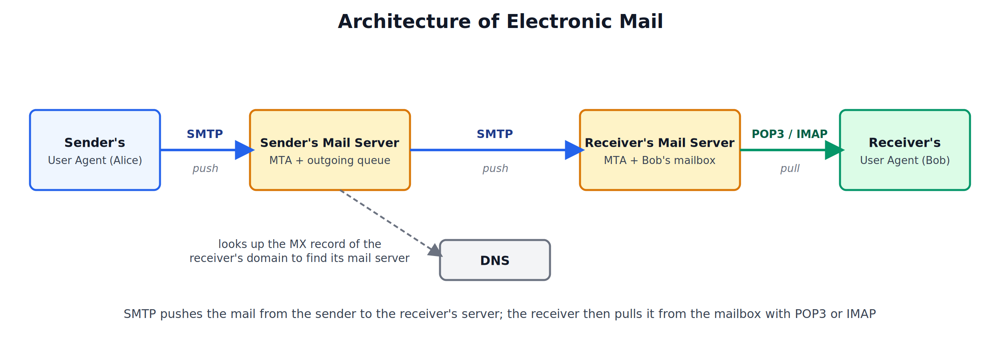
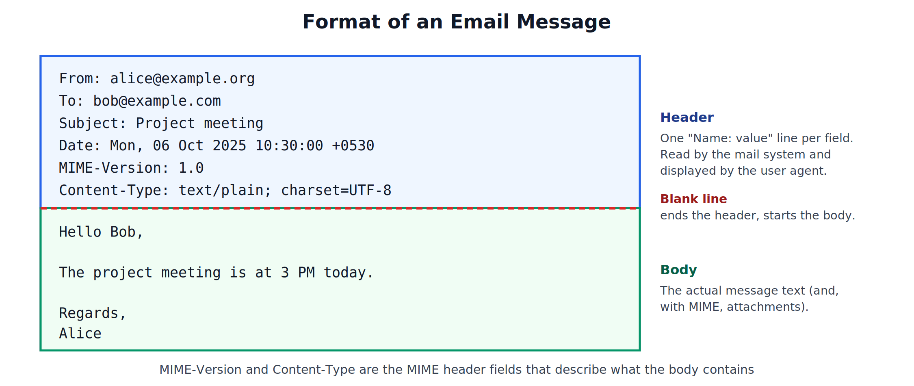
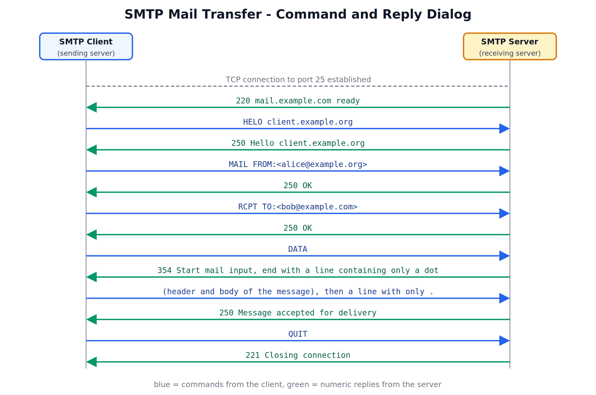
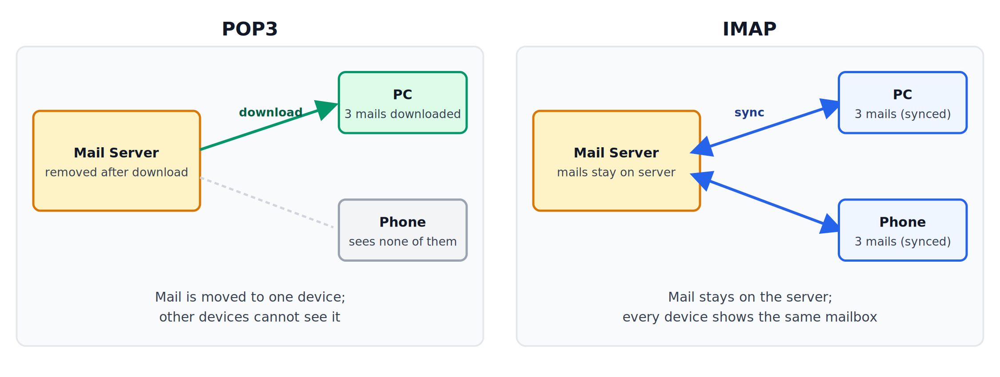

## Electronic Mail: Architecture, User Agent, Message Formats, Transfer, and Delivery

---

## 1. Email Architecture and Services

### What is Electronic Mail

Electronic mail (email) is a store-and-forward messaging service. The sender does not need the receiver to be online: the message is passed from server to server and waits in the receiver's mailbox until the receiver reads it.

### Email Address

An email address has two parts: `local-part@domain`, for example `bob@example.com`. The local part names the mailbox, and the domain part tells the mail system which mail server to deliver to. The domain is resolved through the **MX record** in DNS.

### Components of the Email System

| Component | Role |
|---|---|
| User Agent (UA) | The program the user works with to write, send, read and organise mail |
| Mail server (Mail Transfer Agent, MTA) | Sends mail to other servers, receives mail from them, and keeps outgoing messages in a queue |
| Mailbox | A storage area on the server that holds each user's incoming mail |
| Message queue | Holds outgoing mail on the sending server until it can be delivered, retrying if the destination is unreachable |
| SMTP | The protocol that pushes mail from a client to a server, and from server to server |
| POP3 / IMAP | The protocols the receiver's user agent uses to pull mail out of the mailbox |

### Journey of an Email

1. Alice writes the message in her user agent and clicks send.
2. The user agent hands the message to Alice's mail server using SMTP.
3. Her mail server places the message in its outgoing queue and asks DNS for the **MX record** of `example.com` to find Bob's mail server.
4. Alice's mail server opens an SMTP connection to Bob's mail server and transfers the message.
5. Bob's mail server stores the message in Bob's mailbox.
6. Bob's user agent later retrieves the message using POP3 or IMAP, and Bob reads it.

### Push and Pull

SMTP is a **push** protocol: the sender's side initiates the connection and pushes the mail. Retrieval is a **pull** operation: the receiver's user agent asks the server for the mail. SMTP cannot be used for retrieval, because the receiver's computer is often switched off or offline, so mail must wait in the mailbox on a server that is always on. That is why a separate access protocol (POP3 or IMAP) is needed.

### Services Provided by Email

| Service | Description |
|---|---|
| Composing | Creating messages, with To, Cc and Bcc fields |
| Transfer | Moving the message from the sender to the receiver's mailbox |
| Reporting | Telling the sender what happened, for example a delivery failure (bounce) message |
| Displaying | Presenting the message and its attachments to the user in readable form |
| Disposition | Letting the user decide what to do with a message: read, reply, reply-all, forward, save, delete |
| Attachments | Sending files along with the message |
| Mailing lists and aliases | Sending one message to a group, or forwarding one address to another |

### Common Ports

| Protocol | Port | Used for |
|---|---|---|
| SMTP | 25 | Server-to-server transfer |
| SMTP submission | 587 (465 with SSL) | Client submitting mail to its own server |
| POP3 | 110 (995 with SSL) | Retrieval |
| IMAP | 143 (993 with SSL) | Retrieval |

---

## 2. User Agent

### What is a User Agent

A user agent (UA) is the program that lets a user work with email. It does not move mail between servers (that is the mail server's job); it is the user's interface to the system.

### Functions

- **Composing** new messages and filling in the address and subject fields.
- **Reading** incoming mail, usually as a list showing sender, subject, date and read/unread status.
- **Replying and forwarding** messages.
- **Managing mailboxes**: folders, searching, sorting, and deleting.
- **Sending** the message to the mail server, and **retrieving** messages from it.

### Types of User Agents

| Type | Examples | Notes |
|---|---|---|
| Command-based | mail, mutt | Text commands in a terminal |
| Graphical | Microsoft Outlook, Mozilla Thunderbird | Installed program with a graphical interface |
| Web-based | Gmail, Outlook.com, Yahoo Mail | Runs in a browser and talks to the mail server over HTTP or HTTPS. Mail between servers still travels using SMTP |

---

## 3. Message Formats

### Envelope and Message

The mail system distinguishes two things. The **envelope** holds the addresses the mail servers use to deliver the message (carried in the SMTP commands MAIL FROM and RCPT TO). The **message** itself has a **header** and a **body**, as defined by the Internet standard for message format.

### Header

The header is a set of lines of the form `Field-name: value`. A blank line ends the header and starts the body.

| Header field | Meaning |
|---|---|
| From | Address of the sender |
| To | Address of the main recipient |
| Cc | Copies sent to other recipients, visible to everyone |
| Bcc | Blind copies, hidden from the other recipients |
| Subject | Short description of the message |
| Date | When the message was sent |
| Message-ID | A unique identifier for the message |
| Received | Added by every mail server the message passes through, forming a trace of its route |
| Reply-To | Address to which replies should go, if different from From |

### Body

The body is the actual content of the message.

### MIME (Multipurpose Internet Mail Extensions)

The original message format allowed only plain 7-bit ASCII text. That meant no attachments, no images, and no languages other than English. MIME extends the format without changing SMTP: it defines how non-ASCII data is described and converted to ASCII text so it can travel through the mail system.

MIME adds these header fields:

| Field | Purpose |
|---|---|
| MIME-Version | Says that the message uses MIME (currently 1.0) |
| Content-Type | Describes the type of data in the body, as type/subtype |
| Content-Transfer-Encoding | Says how the data was converted to ASCII for transfer |
| Content-Disposition | Says whether a part is shown inside the message or treated as an attachment |

| Content-Type main type | Examples |
|---|---|
| text | text/plain, text/html |
| image | image/jpeg, image/png |
| audio | audio/mpeg |
| video | video/mp4 |
| application | application/pdf, application/zip |
| multipart | multipart/mixed (several parts, such as text plus attachments) |

| Content-Transfer-Encoding | How it works |
|---|---|
| 7bit / 8bit | Data is already plain ASCII (7bit) or uses 8-bit characters (8bit), and is sent unchanged |
| Base64 | Every 3 bytes (24 bits) are split into four 6-bit groups, and each group is written as one printable ASCII character. Used for binary data such as images and files; increases the size by about one third |
| Quoted-printable | Ordinary characters are sent as they are, and only special characters are replaced with an = sign and their hex code. Used for text that is mostly ASCII |

---

## 4. Message Transfer: SMTP

### What is SMTP

The Simple Mail Transfer Protocol (SMTP) is the protocol that transfers mail from the sending mail server to the receiving mail server (and from a user agent to its own server). It runs over **TCP**, normally on **port 25** for server-to-server transfer. It is a text-based protocol: the client sends commands, and the server answers with three-digit reply codes.

### Phases of an SMTP Transfer

1. **Connection establishment**: the client opens a TCP connection to the server, and the server greets it.
2. **Mail transfer**: the client identifies itself, names the sender and recipient, and sends the message.
3. **Connection termination**: the client says QUIT and the connection closes.

### Main Commands

| Command | Purpose |
|---|---|
| HELO / EHLO | The client introduces itself to the server (EHLO is the extended version) |
| MAIL FROM | Names the sender's address |
| RCPT TO | Names a recipient's address (repeated once per recipient) |
| DATA | Announces that the message header and body follow; the message ends with a line containing only a dot |
| QUIT | Closes the session |
| RSET | Cancels the current mail transaction |

### Common Reply Codes

| Code | Meaning |
|---|---|
| 220 | Service ready |
| 250 | Requested action completed |
| 354 | Start mail input; end with a line containing only a dot |
| 221 | Closing the connection |
| 550 | Mailbox unavailable (for example, no such user) |
| 451 | Local error, try again later |

### Points about SMTP

- SMTP is **store-and-forward**. A message may pass through one or more intermediate mail servers, each of which stores it and forwards it onwards. If the next server is unreachable, the message stays in the queue and is retried for a while before a failure notice is returned to the sender.
- The original SMTP has no login. Modern mail servers add **SMTP authentication** on the submission port (587) so that only registered users can send mail through them.
- SMTP only pushes mail. It cannot fetch mail from a mailbox, which is the job of POP3 and IMAP.

---

## 5. Final Delivery: POP3 and IMAP

Final delivery is the last step: the transfer of a message from the receiver's mail server (where it sits in the mailbox) to the receiver's user agent.

### POP3 (Post Office Protocol, version 3)

POP3 runs over TCP on **port 110** (995 with SSL). It has three phases:

1. **Authorization**: the user agent sends the username and password (USER and PASS).
2. **Transaction**: the user agent lists and fetches messages (LIST, RETR) and marks them for deletion (DELE).
3. **Update**: on QUIT, the server carries out the deletions and the session ends.

POP3 works in two modes. In **delete mode** (the usual default), messages are removed from the server after they are downloaded. In **keep mode**, they are downloaded but left on the server.

### IMAP (Internet Message Access Protocol)

IMAP runs over TCP on **port 143** (993 with SSL). The mail stays on the server, and the user agent works on it remotely. It allows:

- Folders and mailboxes created and managed on the server.
- Looking at only the headers first, and downloading the full message or a single attachment only when needed.
- Searching the mailbox on the server.
- Flags kept on the server (read, answered, deleted), so every device shows the same state.

### Webmail

When mail is read through a website (for example Gmail in a browser), the browser talks to the mail server over HTTP or HTTPS instead of POP3 or IMAP. Transfer between mail servers is still done with SMTP.

### POP3 vs IMAP

| Parameter | POP3 | IMAP |
|---|---|---|
| Where mail is kept | Downloaded to the device, usually removed from the server | Stays on the server |
| Multiple devices | Poor: mail downloaded to one device is not seen on others | Good: all devices see the same mailbox |
| Folders on server | No | Yes |
| Partial download | Whole message only | Headers only, or single parts |
| Server-side search | No | Yes |
| Offline reading | Yes, since everything is downloaded | Only for messages that have been cached |
| Server storage used | Low | High |
| Complexity | Simple | More complex |

---

## 6. Comparison of Mail Protocols

| Protocol | Purpose | Port | Direction |
|---|---|---|---|
| SMTP | Send mail from a client to a server, and between servers | 25 / 587 | Push |
| POP3 | Retrieve mail from the server, usually downloading and removing it | 110 | Pull |
| IMAP | Access and manage mail that stays on the server | 143 | Pull |
| MIME | Not a transfer protocol; an extension of the message format for attachments and non-ASCII data | - | - |

### Who Uses Which Protocol

| Step | Protocol |
|---|---|
| Alice's user agent to Alice's mail server | SMTP |
| Alice's mail server to Bob's mail server | SMTP |
| Bob's mail server to Bob's user agent | POP3 or IMAP (or HTTP/HTTPS for webmail) |
