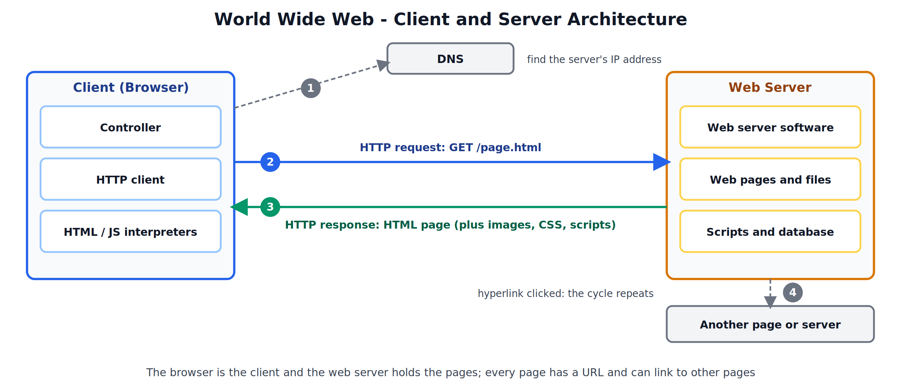
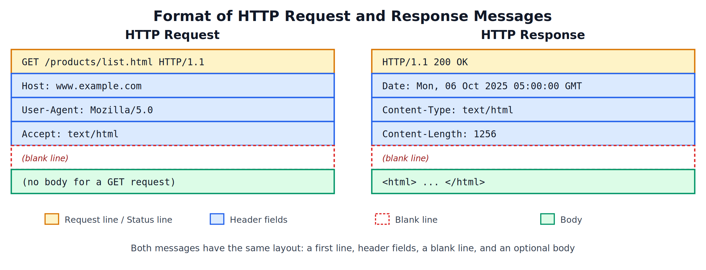
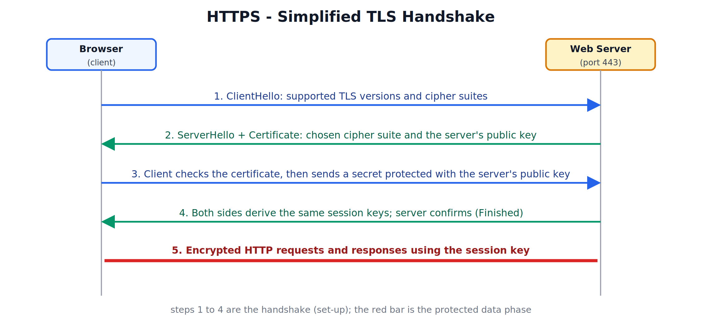
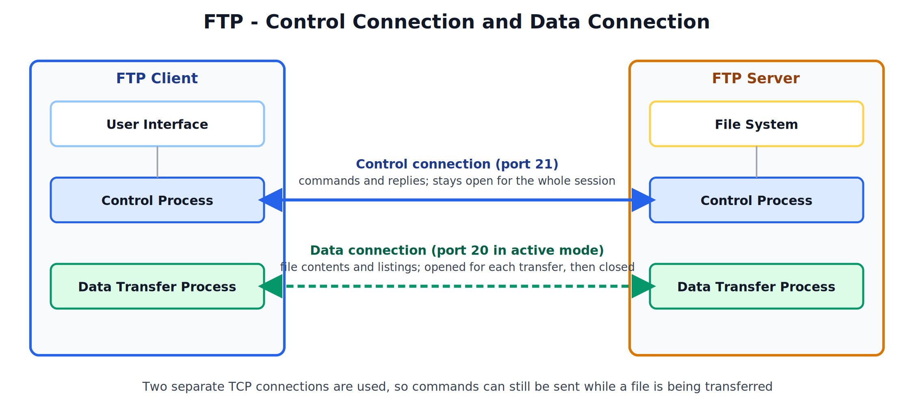
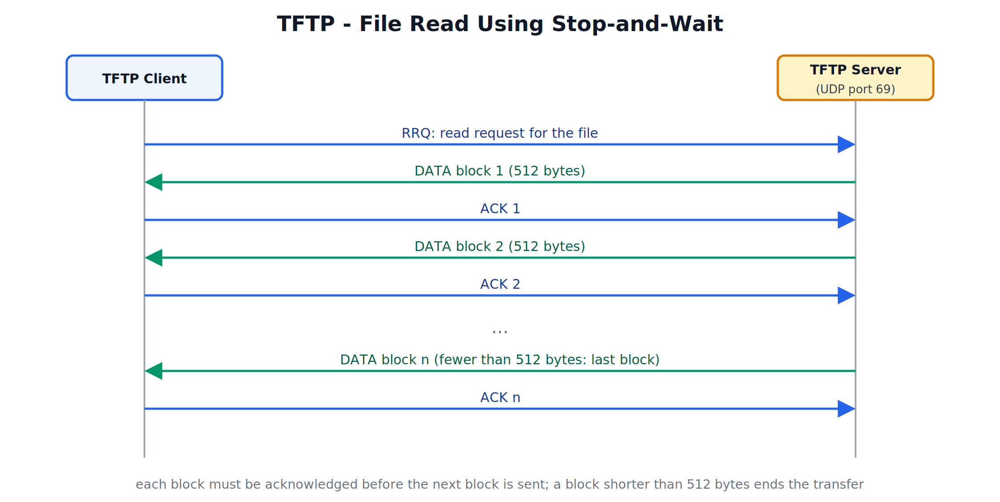

## World Wide Web, HTTP, HTTPS, FTP, and TFTP

---

## 1. World Wide Web: Architectural Overview

### What is the World Wide Web

The World Wide Web (WWW, or the Web) is a distributed information service in which documents called **web pages** are stored on servers all over the world and can be viewed through a program called a **browser**. Pages contain **hypertext**: text with **hyperlinks** that jump to other pages, which may be on the same server or on a different one on the other side of the world. When a page also contains images, audio and video, it is called **hypermedia**.

### Web and Internet

The Internet is the worldwide network of networks (the infrastructure). The Web is one service that runs on top of it, using the protocols HTTP and HTTPS. Email and file transfer are other services on the same Internet.

### Architecture

The Web follows the **client-server** model.



| Component | Role |
|---|---|
| Browser (client) | Program that requests pages and displays them (Chrome, Firefox, Edge, Safari) |
| Web server | Program that stores or generates pages and answers requests (Apache, Nginx, IIS) |
| Web page | A document, usually written in HTML, together with its images, style sheets (CSS) and scripts (JavaScript) |
| URL | The unique address of every page or file |
| HTTP / HTTPS | The protocol the browser and server use to exchange requests and responses |
| DNS | Converts the server's name to an IP address |

### Parts of a Browser

| Part | Function |
|---|---|
| Controller | Receives input from the keyboard or mouse and runs the other parts |
| Client protocol | The protocol used to fetch the page (HTTP or HTTPS, and also FTP) |
| Interpreters | HTML interpreter displays the page; JavaScript interpreter runs scripts inside the page |

### Types of Web Documents

| Type | Description | Example |
|---|---|---|
| Static | The content is fixed and stored in a file on the server; every visitor gets the same page | A college's "About Us" page |
| Dynamic | The server runs a program (PHP, Node.js, Python) when the request arrives and builds the page from a database | A shopping site's product page or a search result page |
| Active | The page carries a program (JavaScript) that runs inside the browser after it has been downloaded | An interactive map or a form that checks input before submitting |

### Working of the Web

1. The user types a URL or clicks a hyperlink.
2. The browser asks DNS for the IP address of the server named in the URL.
3. The browser opens a TCP connection to the server (port 80 for HTTP, 443 for HTTPS).
4. The browser sends an HTTP request for the page.
5. The server finds the file (or runs the program that builds the page) and returns an HTTP response containing the page.
6. The browser displays the page. For each image, style sheet and script mentioned in the page, it sends further requests.
7. When the user clicks a hyperlink, the whole cycle repeats for the next page.

---

## 2. HTTP

### What is HTTP

The HyperText Transfer Protocol (HTTP) is the protocol used by the Web to transfer pages and other resources between a browser and a web server. It uses **TCP**, normally on **port 80**. It works on a request-response basis: the client sends a request, and the server sends back exactly one response.

### Features

- **Text-based**: request and response messages are readable text (in HTTP/1.x).
- **Stateless**: the server does not remember anything about earlier requests from the same client. Each request stands on its own.
- **Client always starts**: the server only answers requests.

### Persistent and Non-persistent Connections

| Type | Behaviour |
|---|---|
| Non-persistent | A new TCP connection is opened for every object and closed after the response. Each object costs extra set-up time |
| Persistent | The TCP connection is kept open, and many requests are sent over it one after another. This is the default in HTTP/1.1 and saves time |

### Versions

| Version | Main idea |
|---|---|
| HTTP/1.0 | One request per TCP connection |
| HTTP/1.1 | Persistent connections by default |
| HTTP/2 | Binary format; many requests share one connection at the same time (multiplexing) |
| HTTP/3 | Runs over QUIC on UDP instead of TCP, to reduce delays |

### Message Formats



**Request message**

- **Request line**: the method, the path of the resource, and the HTTP version.
- **Header fields**: extra information such as `Host` (the server name), `User-Agent` (the browser), `Accept` (the formats the client can handle), `Cookie`.
- **Blank line**: ends the headers.
- **Body**: optional data sent to the server, for example the contents of a submitted form (used with POST).

**Response message**

- **Status line**: the HTTP version, a three-digit status code, and a short phrase.
- **Header fields**: such as `Date`, `Server`, `Content-Type`, `Content-Length`, `Set-Cookie`.
- **Blank line**.
- **Body**: the requested resource, for example the HTML of the page.

### HTTP Methods

| Method | Purpose |
|---|---|
| GET | Retrieve a resource |
| HEAD | Retrieve only the headers of a resource, not the body |
| POST | Send data to the server for processing, for example a form submission |
| PUT | Upload or replace a resource on the server |
| DELETE | Remove a resource from the server |
| OPTIONS | Ask which methods the server supports for a resource |

### Status Codes

The first digit gives the class of the response.

| Class | Meaning | Common codes |
|---|---|---|
| 1xx | Informational | 100 Continue |
| 2xx | Success | 200 OK, 201 Created |
| 3xx | Redirection | 301 Moved Permanently, 302 Found, 304 Not Modified |
| 4xx | Client error | 400 Bad Request, 401 Unauthorized, 403 Forbidden, 404 Not Found |
| 5xx | Server error | 500 Internal Server Error, 502 Bad Gateway, 503 Service Unavailable |

### Cookies

Because HTTP is stateless, websites use **cookies** to remember users. The server sends a small piece of data in a `Set-Cookie` header. The browser stores it and includes it in a `Cookie` header on every later request to that site. This is how a website keeps a user logged in or remembers the items in a shopping cart.

---

## 3. HTTPS

### What is HTTPS

HTTPS (HTTP Secure) is HTTP carried over a secure layer called **TLS (Transport Layer Security)**, the successor of SSL (Secure Sockets Layer). It uses **TCP port 443**. The messages are still ordinary HTTP messages; TLS simply encrypts them on the way.

### What HTTPS Provides

| Goal | Meaning |
|---|---|
| Confidentiality | Data is encrypted, so anyone watching the network sees only unreadable text |
| Integrity | Any change to the data in transit is detected |
| Authentication | The browser can confirm that it is really talking to the genuine website and not an impostor |

### Certificates

A website proves its identity with a **digital certificate** issued by a trusted **Certificate Authority (CA)**. The certificate contains the website's domain name, its public key, the name of the CA that issued it, and its validity period. The browser has a list of trusted CAs and checks the certificate against it. A valid certificate is what produces the padlock shown in the address bar.

### How TLS Works

TLS combines two kinds of cryptography. **Asymmetric** cryptography (a public key and a private key) is slow but lets two strangers agree on a secret safely. **Symmetric** cryptography (one shared key) is fast and is used for the actual data. The handshake uses the first to set up the second.



1. **ClientHello**: the browser tells the server which TLS versions and cipher suites it supports.
2. **ServerHello and Certificate**: the server picks a cipher suite and sends its certificate, which contains its public key.
3. **Key exchange**: the browser checks the certificate, then sends a secret value protected with the server's public key. Only the server, holding the private key, can read it.
4. **Session keys**: both sides use the shared secret to calculate the same symmetric session keys, and the server confirms it is ready.
5. **Protected data**: all further HTTP requests and responses are encrypted with the session key.

### HTTP vs HTTPS

| Parameter | HTTP | HTTPS |
|---|---|---|
| Port | 80 | 443 |
| Encryption | None; data travels as readable text | Encrypted using TLS |
| Server identity | Not verified | Verified through a certificate |
| Data tampering | Possible without detection | Detected |
| Address prefix | http:// | https:// |
| Speed | Slightly faster | Slight overhead for the handshake and encryption |
| Suitable for | Public information with nothing private | Logins, payments, and everything else on the modern Web |

---

## 4. FTP

### What is FTP

The File Transfer Protocol (FTP) is used to copy files between a client and a server over a network: uploading, downloading, and managing files in remote directories. It uses **TCP**, so delivery is reliable.

### Two Connections

FTP uses two separate TCP connections.



| Connection | Port | Purpose | Lifetime |
|---|---|---|---|
| Control connection | 21 | Carries commands from the client and replies from the server (login, directory changes, transfer requests) | Stays open for the whole session |
| Data connection | 20 (active mode) | Carries the actual file contents and directory listings | Opened for each transfer, then closed |

Keeping them separate means the client can still send commands (such as abort) while a file transfer is in progress, and the simple text commands are kept apart from the file data.

### Active and Passive Modes

| Mode | How the data connection is made |
|---|---|
| Active | The client tells the server which port it is listening on, and the server opens the data connection from its port 20 to the client. Firewalls and NAT on the client side often block this |
| Passive | The server opens a port and tells the client, and the client opens the data connection to it. Both connections are started by the client, so it works through firewalls and NAT |

### Commands and Replies

| Command | Meaning |
|---|---|
| USER, PASS | Send the user name and password |
| LIST | List the files in the current directory |
| CWD | Change the working directory |
| RETR | Retrieve (download) a file |
| STOR | Store (upload) a file |
| DELE | Delete a file |
| QUIT | End the session |

| Reply code | Meaning |
|---|---|
| 220 | Server ready |
| 331 | User name accepted, password needed |
| 230 | Login successful |
| 226 | Transfer complete; data connection closing |
| 550 | Requested file not available |

A short session:

```
Client: USER student
Server: 331 Password required
Client: PASS ********
Server: 230 Login successful
Client: RETR notes.pdf
Server: 226 Transfer complete
Client: QUIT
Server: 221 Goodbye
```

### Other Features

- **Transfer types**: ASCII mode for text files, and binary (image) mode for everything else such as programs, images and archives.
- **Anonymous FTP**: many public servers allow login with the user name `anonymous` so that anyone can download files.
- **Security**: FTP sends the user name and password as plain text, so they can be read by anyone monitoring the network. Secure alternatives are **FTPS** (FTP over TLS) and **SFTP** (file transfer over SSH).

---

## 5. TFTP

### What is TFTP

The Trivial File Transfer Protocol (TFTP) is a very small and simple file transfer protocol. It uses **UDP on port 69**, and because UDP is unreliable, TFTP builds its own reliability with acknowledgements and timers.

### Working

- The client sends a **read request (RRQ)** or **write request (WRQ)** naming the file.
- The file is sent in fixed blocks of **512 bytes**, each numbered.
- After each DATA block the receiver sends an **ACK** for that block, and the sender waits for it before sending the next block. This is the **stop-and-wait** method of flow control.
- If a block or ACK is lost, the timer runs out and the block is sent again.
- A block **shorter than 512 bytes** is the last one, and it ends the transfer.



### Packet Types

| Packet | Purpose |
|---|---|
| RRQ | Request to read a file |
| WRQ | Request to write a file |
| DATA | A numbered block of file data |
| ACK | Acknowledges a block |
| ERROR | Reports a problem (for example, file not found) |

### Limitations and Uses

- No user authentication and no encryption.
- No directory listing and no way to browse or rename files.
- Slow for large files, since only one block is in flight at a time.
- Used where simplicity matters more than features: booting diskless computers and network devices over the network, and loading configuration files or firmware onto routers and switches inside a trusted network.

### FTP vs TFTP

| Parameter | FTP | TFTP |
|---|---|---|
| Transport protocol | TCP | UDP |
| Port | 21 (control), 20 (data) | 69 |
| Authentication | User name and password | None |
| Connections | Two (control and data) | One exchange over UDP |
| Commands | Many (list, change directory, delete, and so on) | Only read and write |
| Reliability | Provided by TCP | Provided by the protocol itself (ACK and timer) |
| Directory listing | Yes | No |
| Complexity | Higher | Very low; small enough to fit in a device's boot code |
| Typical use | Uploading and downloading files on servers | Booting devices, copying configurations and firmware |

---

## 6. Comparison of the Protocols

| Protocol | Port | Transport | Secure | Purpose |
|---|---|---|---|---|
| HTTP | 80 | TCP | No | Transfer web pages |
| HTTPS | 443 | TCP (with TLS) | Yes | Transfer web pages securely |
| FTP | 21 and 20 | TCP | No (FTPS and SFTP are secure) | Full-featured file transfer |
| TFTP | 69 | UDP | No | Minimal file transfer for booting and configuration |
