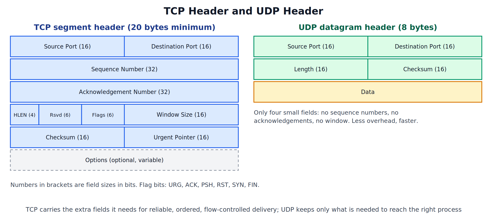
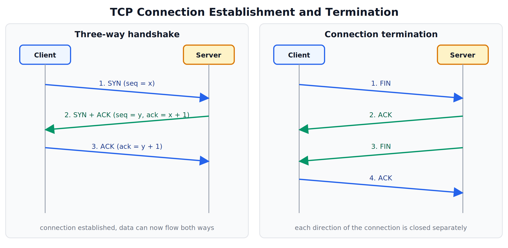
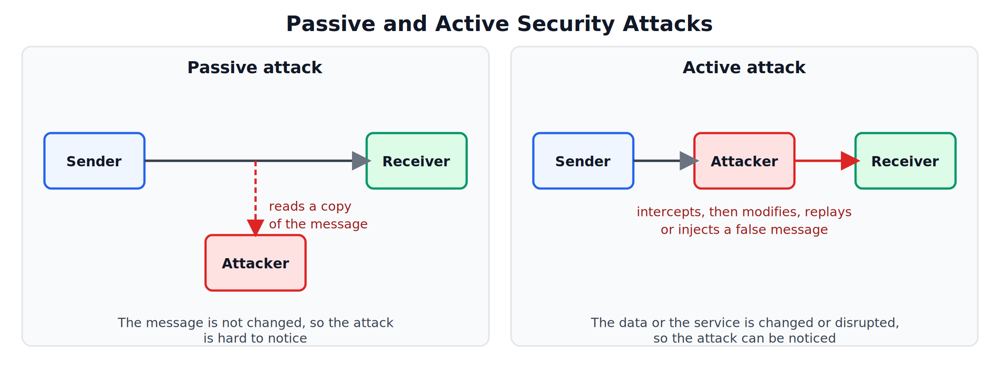
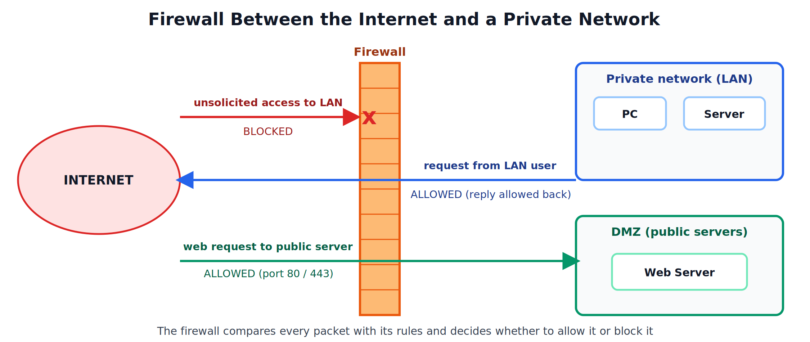

## TCP, UDP, Network Security, Firewall, Network Commands

---

## 1. Transport Protocols: TCP and UDP

The transport layer delivers data from one **process** on a host to a process on another host. To tell processes apart, it uses **port numbers**. An IP address plus a port number identifies one endpoint of a connection (a **socket**), for example `203.0.113.10:443`. Two protocols do this job: TCP and UDP.

### Common Port Numbers

| Port | Protocol | Transport |
|---|---|---|
| 20, 21 | FTP (data, control) | TCP |
| 22 | SSH | TCP |
| 23 | Telnet | TCP |
| 25 | SMTP | TCP |
| 53 | DNS | UDP (TCP for large replies) |
| 67, 68 | DHCP | UDP |
| 69 | TFTP | UDP |
| 80 | HTTP | TCP |
| 110 | POP3 | TCP |
| 143 | IMAP | TCP |
| 443 | HTTPS | TCP |

Ports 0 to 1023 are the **well-known ports**, reserved for standard services.

---

## 2. TCP

### What is TCP

The Transmission Control Protocol (TCP) is a **connection-oriented, reliable** transport protocol. Before any data moves, the two ends set up a connection. TCP then makes sure that all the data arrives, in order, without errors and without duplicates.

### Features

| Feature | Meaning |
|---|---|
| Connection-oriented | A connection is set up before data is sent and closed afterwards |
| Reliable delivery | Every segment is acknowledged; lost or damaged segments are sent again |
| Byte stream | The data from the application is treated as a stream of bytes, cut into segments for sending |
| Sequence numbers | Each byte is numbered, so the receiver can put segments back in order and detect missing or duplicate ones |
| Flow control | The receiver advertises a window size, so the sender does not send more than it can handle (sliding window) |
| Error control | A checksum detects damaged segments; retransmission repairs them |
| Congestion control | The sender slows down when the network is overloaded |
| Full duplex | Data can flow in both directions at the same time on one connection |

### TCP Header



| Field | Purpose |
|---|---|
| Source Port, Destination Port | Identify the sending and receiving processes |
| Sequence Number | Number of the first data byte in this segment |
| Acknowledgement Number | The next byte the sender of this segment expects to receive |
| HLEN | Length of the header |
| Flags | URG (urgent data), ACK (acknowledgement valid), PSH (deliver data immediately), RST (reset the connection), SYN (open a connection), FIN (close a connection) |
| Window Size | How many bytes the sender of this segment can still accept (flow control) |
| Checksum | Detects errors in the header and data |
| Urgent Pointer | Marks the end of urgent data when URG is set |
| Options | Optional extras |

### Connection Establishment: Three-way Handshake



1. **SYN**: the client sends a segment with the SYN flag and its starting sequence number x.
2. **SYN + ACK**: the server replies with SYN and ACK set. It gives its own starting sequence number y and acknowledges the client's with ack = x + 1.
3. **ACK**: the client acknowledges the server's number with ack = y + 1.

Three segments are needed because both sides must announce their own starting sequence number and have it acknowledged by the other side. After the third segment the connection is established and data can be sent in both directions.

### Connection Termination

Each direction is closed separately, so four segments are used:

1. The client sends **FIN** (it has no more data to send).
2. The server sends **ACK**.
3. When the server has finished sending its own data, it sends **FIN**.
4. The client sends the final **ACK**.

### Reliable Delivery in Practice

- The sender starts a timer for every segment it sends. If the ACK does not arrive before the timer expires, the segment is retransmitted.
- The receiver uses the sequence numbers to reorder segments that arrive out of order, and discards duplicates.
- The receiver's window size keeps the sender from overflowing its buffer.

---

## 3. UDP

### What is UDP

The User Datagram Protocol (UDP) is a **connectionless, unreliable** transport protocol. It simply takes the data, adds a small header with port numbers, and hands it to IP. There is no connection set-up, no acknowledgement, no retransmission, and no ordering.

### Features

- **Connectionless**: each datagram is independent, so nothing is set up or closed.
- **Unreliable**: lost datagrams are not detected or repaired by UDP itself. If reliability is needed, the application must provide it.
- **Low overhead**: the header is only 8 bytes (source port, destination port, length, checksum).
- **Fast**: no handshake and no waiting for acknowledgements, so there is very little delay.
- **Supports broadcast and multicast**, since it does not need a connection to one particular receiver.

### Where UDP is Used

- DNS queries (a short question and a short answer)
- DHCP and TFTP
- Live audio and video, VoIP calls, and online games, where a late packet is useless, so it is better to skip it than to wait for a resend
- SNMP network management

---

## 4. Comparison of TCP and UDP

| Parameter | TCP | UDP |
|---|---|---|
| Connection | Connection-oriented (handshake needed) | Connectionless |
| Reliability | Reliable: acknowledgements and retransmission | Unreliable: best effort |
| Ordering | Data delivered in order | No ordering guarantee |
| Speed | Slower, because of the extra work | Faster |
| Header size | 20 to 60 bytes | 8 bytes |
| Flow and congestion control | Yes | No |
| Error checking | Checksum, and recovery by retransmission | Checksum (detects errors only) |
| Data unit | Segment | Datagram |
| Broadcast / multicast | Not supported | Supported |
| Typical uses | Web, email, file transfer, remote login | DNS, streaming, VoIP, gaming, DHCP |

---

## 5. Network Security

### What is Network Security

Network security is the set of measures that protect a network and the data travelling over it from unauthorised access, misuse, damage, and disruption.

### Security Goals

| Goal | Meaning |
|---|---|
| Confidentiality | Only the intended people can read the data |
| Integrity | Data is not altered, accidentally or deliberately, without being detected |
| Availability | The network and its services are working and reachable when needed |
| Authentication | Each party can prove that it is who it claims to be |
| Non-repudiation | A sender cannot later deny having sent a message |

### Types of Attacks



| Category | Attack | Description |
|---|---|---|
| Passive | Eavesdropping (sniffing) | Reading data as it travels over the network |
| Passive | Traffic analysis | Studying who talks to whom, and how often, even if the data is encrypted |
| Active | Masquerading (spoofing) | Pretending to be another user, device or address |
| Active | Modification | Changing the contents of a message in transit |
| Active | Replay | Capturing a valid message and sending it again later |
| Active | Man-in-the-middle | Secretly placing oneself between two parties, reading and altering what passes between them |
| Active | Denial of Service (DoS / DDoS) | Flooding a server or network with requests so that real users cannot use it (DDoS uses many machines at once) |

Other common threats:

| Threat | Description |
|---|---|
| Virus | Malicious code that attaches itself to a file or program and spreads when it is run |
| Worm | Malicious program that spreads by itself across the network |
| Trojan horse | Harmful program that looks like useful software |
| Ransomware | Locks or encrypts a victim's files and demands payment |
| Phishing | Fake emails or websites that trick users into giving away passwords or card details |
| Brute-force attack | Trying many passwords until the right one is found |

### Security Measures

| Measure | Purpose |
|---|---|
| Encryption (symmetric and asymmetric) | Keeps data confidential (used in HTTPS, VPNs, secure email) |
| Authentication and strong passwords | Proves identity; multi-factor authentication adds a second proof |
| Digital signatures and hashing | Provide integrity, authentication and non-repudiation |
| Firewall | Filters traffic between networks according to rules |
| Intrusion Detection / Prevention System (IDS / IPS) | Watches traffic for signs of attack, and can block it |
| VPN (Virtual Private Network) | Creates an encrypted tunnel across a public network |
| Antivirus and regular updates | Remove malware and fix known weaknesses |
| Backups | Allow recovery after ransomware or hardware failure |

---

## 6. Firewall

### What is a Firewall

A firewall is a device or program placed between a trusted network and an untrusted one (usually a private network and the Internet). It examines the traffic passing through and, following a set of **rules**, allows or blocks each packet.



### What a Firewall Does

- Blocks unwanted and unsolicited connections coming in from outside.
- Allows the traffic that is permitted, such as requests from LAN users and replies to them.
- Restricts which services and ports are reachable (for example only 80 and 443 on a public web server).
- Logs traffic, which helps in spotting attacks.

A firewall may be **hardware** (a dedicated device or a router feature) or **software** (running on a computer). A separate zone called the **DMZ** (demilitarised zone) is often placed behind the firewall to hold public servers, so that if one of them is attacked, the private network is still protected.

### Types of Firewalls

| Type | Works at | How it works | Advantages | Limitations |
|---|---|---|---|---|
| Packet-filtering | Network / Transport layer | Checks each packet on its own against rules using the source and destination IP address, port number and protocol | Fast and simple | Does not know whether a packet belongs to a real conversation; cannot see the data inside |
| Stateful inspection | Network / Transport layer | Keeps a table of active connections, and allows a packet only if it belongs to a connection that is already known | More secure than a simple packet filter; automatically allows replies | Uses more memory and processing |
| Circuit-level gateway | Session / Transport layer | Checks that the TCP handshake is valid and then lets the session pass, without looking at the data | Fast; hides internal addresses | Cannot examine the contents |
| Application-level (proxy) firewall | Application layer | Acts as a go-between: the client connects to the proxy, and the proxy makes a separate connection to the server. It can inspect the actual content | Most thorough checking; hides internal hosts completely | Slowest; needs a proxy for each application |
| Next-generation firewall | Up to Application layer | Combines stateful inspection with deep packet inspection, application awareness, and intrusion prevention | Detailed control and protection | More expensive and complex |

### Example Packet-filter Rules

| Rule | Source | Destination | Protocol / Port | Action |
|---|---|---|---|---|
| 1 | Any | Web server | TCP 80, 443 | Allow |
| 2 | LAN | Any | Any | Allow |
| 3 | Any | LAN | Any | Deny |

The rules are checked in order, and the first one that matches decides the action. A final default rule usually denies everything that has not been allowed.

---

## 7. Network Commands

These commands are run from the command prompt (Windows) or the terminal (Linux). They are used to check settings and to find faults in a network. The outputs shown are examples.

### Summary

| Task | Windows | Linux |
|---|---|---|
| Test reachability | ping | ping |
| Show IP configuration | ipconfig | ifconfig or ip addr |
| Trace the route to a host | tracert | traceroute |
| Query DNS | nslookup | nslookup or dig |
| Show connections and ports | netstat | netstat or ss |
| Show the ARP table | arp -a | arp -a or ip neigh |
| Show the computer name | hostname | hostname |

### ping

Tests whether a host can be reached, and how long a round trip takes. It sends **ICMP echo request** packets and waits for **echo replies**.

```
ping www.example.com

Reply from 203.0.113.10: bytes=32 time=24ms TTL=56
Reply from 203.0.113.10: bytes=32 time=23ms TTL=56
Reply from 203.0.113.10: bytes=32 time=25ms TTL=56

Packets: Sent = 3, Received = 3, Lost = 0 (0% loss)
```

Useful options: `-t` (Windows) keeps pinging until stopped; `-n 5` (Windows) or `-c 5` (Linux) sends five requests. `ping 127.0.0.1` tests the computer's own network software.

### ipconfig / ifconfig

Shows the network settings of the computer.

```
ipconfig /all

IPv4 Address . . . . . : 192.168.1.10
Subnet Mask  . . . . . : 255.255.255.0
Default Gateway  . . . : 192.168.1.1
DNS Servers  . . . . . : 8.8.8.8
Physical Address . . . : 00-1A-2B-3C-4D-5E
DHCP Enabled . . . . . : Yes
```

| Option | Use |
|---|---|
| ipconfig | Basic IP address, mask and gateway |
| ipconfig /all | Full details, including MAC address, DHCP and DNS |
| ipconfig /release and /renew | Give up the DHCP address and ask for a new one |
| ipconfig /flushdns | Clear the DNS cache |

### tracert / traceroute

Shows the path a packet takes to a destination, one router (hop) at a time, with the time taken for each. It works by sending packets with the TTL value set to 1, then 2, then 3, and so on. Each router that discards a packet because its TTL reached zero sends back an ICMP message, which reveals that router.

```
tracert www.example.com

1    2 ms   192.168.1.1
2    9 ms   10.20.0.1
3   15 ms   198.51.100.5
4   24 ms   203.0.113.10
Trace complete.
```

### nslookup

Queries DNS to find the IP address of a name, or the name of an IP address.

```
nslookup www.example.com

Server:   dns.google
Address:  8.8.8.8

Name:     www.example.com
Address:  203.0.113.10
```

Other record types can be requested, for example the mail servers of a domain, with `nslookup -type=MX example.com`.

### netstat

Shows the active network connections, the ports the computer is listening on, and network statistics.

```
netstat -an

Proto  Local Address        Foreign Address       State
TCP    192.168.1.10:51234   203.0.113.10:443      ESTABLISHED
TCP    0.0.0.0:135          0.0.0.0:0             LISTENING
```

| Option | Use |
|---|---|
| -a | Show all connections and listening ports |
| -n | Show addresses and ports as numbers, without name lookup |
| -r | Show the routing table |
| -e | Show Ethernet statistics |
| -b | Show the program that owns each connection (Windows, needs administrator rights) |

### arp and hostname

`arp -a` displays the ARP table, which maps the IP addresses of nearby devices to their MAC addresses. `hostname` prints the name of the computer.

---
